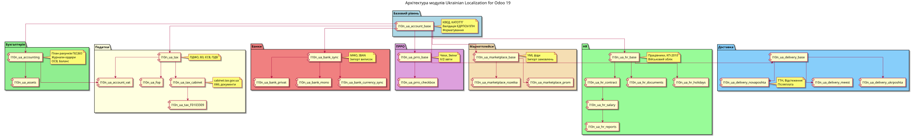

# Українська локалізація Odoo 19

Комплексне рішення для управління бізнесом та установами в Україні: бухгалтерія, податки, банки, ПРРО, доставка, маркетплейси, HR/зарплата, а також галузеві рішення для бюджетних, освітніх і медичних установ.

> Цей файл — **головний індекс реалізованих напрямків**. Деталі по кожному домену (перелік модулів, версії, ключові моделі й можливості) — у відповідних документах у теці [`docs/`](docs/).
>
> Практичні покрокові сценарії «як зробити» — у [`docs/howto/`](docs/howto/README.md) (звірено на демо-сервері).
>
> Use-кейси по доменах + **звірка з законодавством** (тестові сценарії, аудит відповідності) — у [`docs/usecases/`](docs/usecases/README.md).

---

## Реалізовані домени

**Всього: 68 модулів** для Odoo 19.

| Напрямок | Модулів | Статус | Деталі |
|----------|:-------:|:------:|--------|
| Базові та бухгалтерія | 6 | 🟢 | [docs/core_accounting.md](docs/core_accounting.md) |
| Податки та звітність | 6 | 🟢 | [docs/taxes.md](docs/taxes.md) |
| Банки та платежі | 5 | 🟢 | [docs/banks.md](docs/banks.md) |
| ПРРО (фіскалізація) | 2 | 🟢 | [docs/prro.md](docs/prro.md) |
| Доставка | 4 | 🟡 | [docs/delivery.md](docs/delivery.md) |
| Маркетплейси | 5 | 🟢 | [docs/marketplaces.md](docs/marketplaces.md) |
| Договори з клієнтами | 1 | 🟢 | [docs/agreements.md](docs/agreements.md) |
| Ціни постачальників | 6 | ✅ | [docs/supplier_prices.md](docs/supplier_prices.md) |
| HR та зарплата (1С:ЗУП) | 13 | ✅ | [docs/hr.md](docs/hr.md) |
| Бюджетні установи | 8 | 🟢 | [docs/budget.md](docs/budget.md) |
| Заклади освіти | 6 | 🟡 | [docs/education.md](docs/education.md) |
| Заклади охорони здоров'я | 6 | 🟢 | [docs/medicine.md](docs/medicine.md) |

### Легенда готовності

| Статус | Значення |
|--------|----------|
| ✅ **Стабільний** | Функціонал реалізований і покритий тестами; готовий до використання |
| 🟢 **Робочий** | Функціонал реалізований; тести часткові або відсутні |
| 🟡 **Бета** | Базовий каркас, напрямок в активній розробці |
| 📦 **Збірка** | Мета-модуль, що встановлює стек залежностей |

> Готовність напрямку у таблиці — за найслабшим суттєвим модулем. У детальних документах статус наведено окремо для кожного модуля.

### Коротко про кожен домен

- **Базові та бухгалтерія** — фундамент локалізації (довідники КВЕД/КАТОТТГ/ДПІ, план рахунків, ОСВ), повний пакет бухгалтера (каса, акти, Ф1/Ф2), облік основних засобів із проводками амортизації (Дт витрати / Кт 131) та друковані первинні документи.
- **Податки та звітність** — ПДФО/ВЗ/ЄСВ/ПДВ/ЄП, реєстри й декларація з ПДВ, єдиний податок ФОП з реальним XML декларації (F0103309), об'єднана звітність 4ДФ, кабінет платника ДПС.
- **Банки та платежі** — імпорт виписок, інтеграції API ПриватБанку й monobank, синхронізація курсів НБУ та платіжні QR-посилання.
- **ПРРО (фіскалізація)** — фіскальні чеки й зміни, інтеграція з Checkbox API, Z/X-звіти.
- **Доставка** — інфраструктура перевізників і довідник відділень; інтеграції Нової Пошти, Укрпошти та Meest поки що каркасні.
- **Маркетплейси** — бекенди, замовлення, YML/XML-фіди, вебхуки; повні API-інтеграції Rozetka і Prom.ua, прайс-фіди Price.ua та Hotline.
- **Договори з клієнтами** — українська типізація договорів на базі OCA `agreement`, електронний підпис, друковані форми, періодичні рахунки.
- **Ціни постачальників** — рушій імпорту прайс-листів у `product.supplierinfo` з підключуваними парсерами (CSV/XML/XLSX) і джерелами (HTTP API/SFTP), повністю покритий тестами.
- **HR та зарплата** — повна заміна 1С:ЗУП: кадровий і військовий облік, договори, накази, відпустки, розрахунок зарплати з податками та виконавчими документами, табель П-5, звітність ПФУ/ДПС.
- **Бюджетні установи** — класифікатори, план рахунків №1203, кошториси з контролем виконання, інтеграція з ДКСУ (Казначейство) та звітність.
- **Заклади освіти** — контингент, стипендії, харчування, каркас ЄДЕБО (в активній розробці).
- **Заклади охорони здоров'я** — пацієнти, декларації ПМД, договори НСЗУ з капітацією, клінічна картка, каркас інтеграції eHealth.

---

## Архітектура модулів



Оглядову діаграму архітектури згенеровано скриптом [`diagrams/gen_full_architecture.py`](diagrams/gen_full_architecture.py) (перегенерувати після додавання модулів: `python3 diagrams/gen_full_architecture.py`). Решта діаграм — у теці [`diagrams/`](diagrams/) (`.puml` + `.svg`): структура меню, HR, модель даних, процеси ПРРО, банків, прийому на роботу, розрахунку зарплати тощо.

---

## Швидке встановлення

### ФОП (мінімум)
```bash
odoo-bin -d <db> -i l10n_ua_account_base,l10n_ua_tax,l10n_ua_fop,l10n_ua_bank_sync --stop-after-init
```

### Повна бухгалтерія
```bash
odoo-bin -d <db> -i l10n_ua_accounting,l10n_ua_tax,l10n_ua_account_vat,l10n_ua_assets,l10n_ua_tax_cabinet --stop-after-init
```

### HR + зарплата
```bash
odoo-bin -d <db> -i l10n_ua_hr --stop-after-init
```

### ПРРО + банки
```bash
odoo-bin -d <db> -i l10n_ua_prro_checkbox,l10n_ua_bank_privat,l10n_ua_bank_mono --stop-after-init
```

### E-commerce (доставка + маркетплейси)
```bash
odoo-bin -d <db> -i l10n_ua_delivery_novaposhta,l10n_ua_marketplace_rozetka,l10n_ua_marketplace_prom --stop-after-init
```

### Ціни постачальників
```bash
odoo-bin -d <db> -i l10n_ua_supplier_prices_base,l10n_ua_supplier_prices_csv,l10n_ua_supplier_prices_xlsx --stop-after-init
```

### Договори з клієнтами
```bash
# Потребує OCA: agreement, agreement_sale, sign_oca, contract (гілка 19.0) в addons_path
odoo-bin -d <db> -i l10n_ua_agreement --stop-after-init
```

### Галузеві збірки
```bash
# Бюджетна установа
odoo-bin -d <db> -i l10n_ua_budget --stop-after-init
# Заклад освіти
odoo-bin -d <db> -i l10n_ua_education --stop-after-init
# Заклад охорони здоров'я
odoo-bin -d <db> -i l10n_ua_medecin --stop-after-init
# Все одразу
odoo-bin -d <db> -i l10n_ua_full --stop-after-init
```

### Оновлення
```bash
odoo-bin -d <db> -u <module_name> --stop-after-init
```

---

## Налаштування компанії

1. **Налаштування → Компанії → [Ваша компанія]**
2. Вкладка **«Ukrainian Tax Settings»**:
   - Організаційно-правова форма (ФОП, ТОВ, тощо)
   - Податкова інспекція (ДПІ)
   - Група ФОП та ставка (якщо ФОП)
   - Коди діяльності (КВЕД)

---

## Контакти

**Автори:** Святослав Надозірний, Ярослав Кравець
**Website:** https://many2one.online

## Ліцензія

LGPL-3.0
