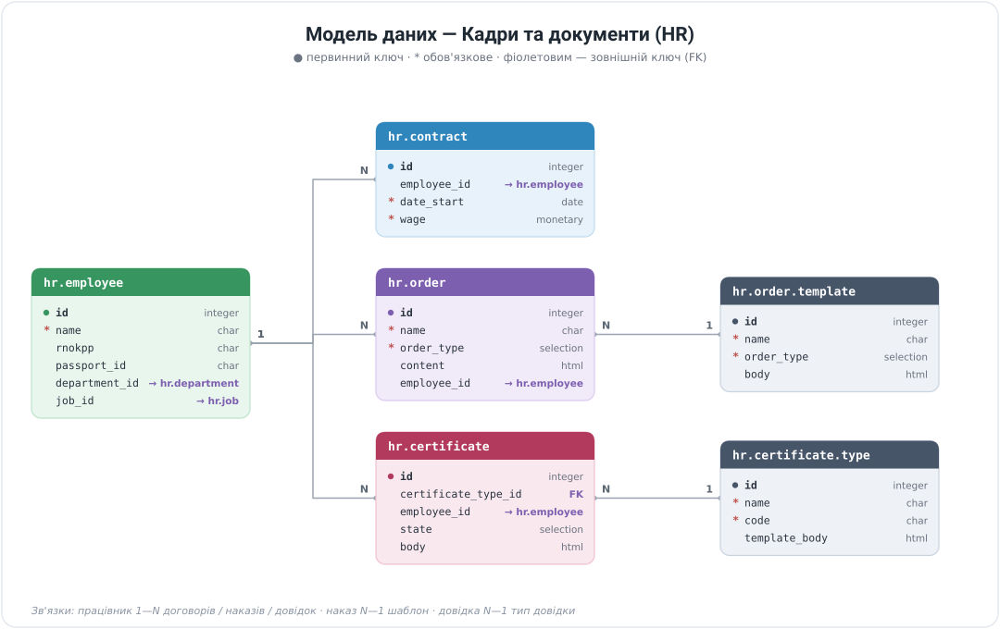
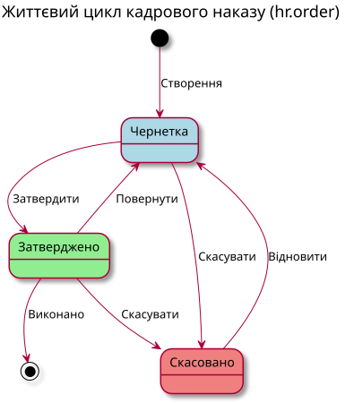
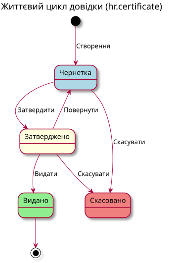
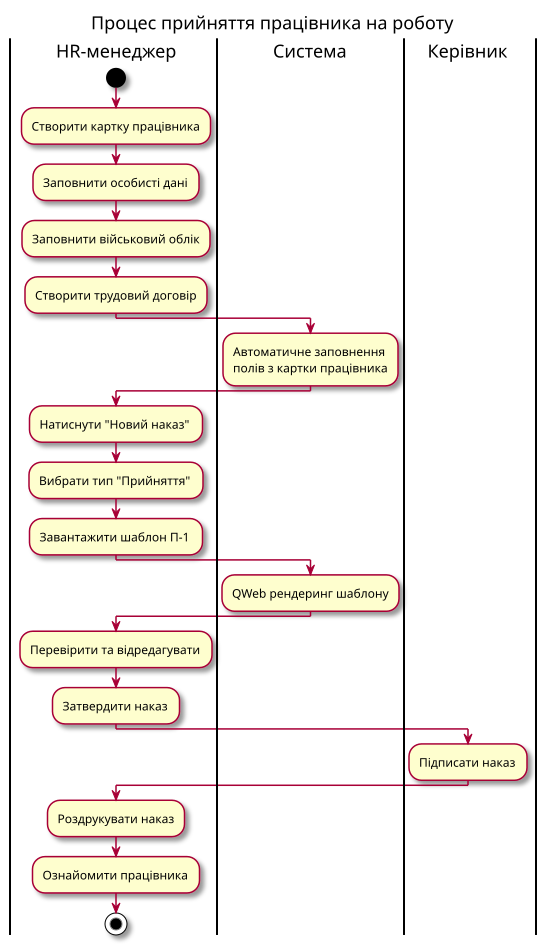

# Українська локалізація HR для Odoo 19

Комплексне рішення для управління персоналом відповідно до законодавства України. Замінює 1C:ЗУП (1С: Зарплата і Управління Персоналом).

## Архітектура модулів


```
l10n_ua_hr_base (Базовий модуль)
├── l10n_ua_hr_contract (Трудові договори)
│   └── l10n_ua_hr_salary (Розрахунок зарплати)
│       └── l10n_ua_hr_reports (Звітність ПФУ/ДПС)
├── l10n_ua_hr_holidays (Відпустки та лікарняні)
├── l10n_ua_hr_timesheet (Табель обліку робочого часу)
├── l10n_ua_hr_documents (Накази та кадрові документи)
│   └── l10n_ua_hr_documents_certificates (Довідки)
└── l10n_ua_hr_attendance_sheet (Табель П-5)
```

## Модель даних



---

## Модулі та процеси

### 1. l10n_ua_hr_base — Базовий модуль

**Призначення:** Фундамент системи з базовими даними працівників.

#### Основні моделі:
- **hr.employee** — розширення картки працівника
- **hr.kp2010** — Класифікатор професій ДК 003:2010
- **hr.staffing.table** — Штатний розпис
- **hr.employee.child** — Діти працівника
- **hr.employee.benefit** — Пільги працівника

#### Дані працівника:
| Розділ | Поля |
|--------|------|
| Особисті дані | ПІБ, дата народження, стать, сімейний стан |
| Документи | РНОКПП (ІПН), паспорт/ID-картка |
| Військовий облік | Категорія, звання, ТЦК, бронювання, Резерв+ ID |
| Пільги | Група інвалідності, категорія Чорнобиля, статус ветерана |
| Освіта | Навчальний заклад, спеціальність, рік закінчення |
| Адреси | Реєстрація, фактичне проживання |

#### Процеси:
1. **Створення працівника** → Заповнення особистих даних → Документи → Військовий облік
2. **Штатний розпис** → Підрозділи → Посади → Ставки → Оклади
3. **Друк П-2** (Особова картка) — з картки працівника

---

### 2. l10n_ua_hr_contract — Трудові договори

**Призначення:** Управління трудовими договорами та умовами праці.

#### Основні моделі:
- **hr.contract** — розширення трудового договору
- **hr.contract.allowance** — Надбавки до договору
- **hr.work.schedule** — Графіки роботи
- **hr.termination.reason** — Підстави звільнення

#### Типи договорів:
- Безстроковий трудовий договір
- Строковий трудовий договір
- Цивільно-правовий договір
- Гіг-контракт (Дія.City)
- Авторський договір

#### Режими роботи:
- Повний робочий день
- Неповний робочий день
- Гнучкий графік
- Віддалена робота
- Змінний графік

#### Процеси:
1. **Прийняття на роботу:**
   - Створення працівника → Створення договору → Наказ про прийняття
2. **Переведення:**
   - Зміна посади/підрозділу в договорі → Наказ про переведення
3. **Звільнення:**
   - Закриття договору → Вибір підстави (стаття КЗпП) → Наказ про звільнення

---

### 3. l10n_ua_hr_documents — Накази та документи

**Призначення:** Формування кадрових наказів за типовими формами.

#### Основні моделі:
- **hr.order** — Кадровий наказ
- **hr.order.template** — Шаблон наказу (QWeb)
- **hr.order.type** — Тип наказу
- **hr.personal.file** — Особова справа

#### Типи наказів:
| Тип | Форма | Опис |
|-----|-------|------|
| hiring | П-1 | Про прийняття на роботу |
| dismissal | П-4 | Про припинення трудового договору |
| transfer | П-5 | Про переведення |
| vacation | П-3 | Про надання відпустки |
| bonus | — | Про преміювання |
| sick_leave | — | Про оплату лікарняного |
| business_trip | — | Про відрядження |

#### Життєвий цикл наказу:



#### Процеси:
1. **Створення наказу:**
   - Картка працівника → Кнопка "Новий наказ" → Вибір типу → Завантаження шаблону → Редагування → Затвердження → Друк

2. **Шаблони QWeb:**
   ```xml
   <t t-esc="employee.name"/>
   <t t-esc="company.name"/>
   <t t-esc="format_date_ua(order.date)"/>
   ```

#### Контекстні змінні шаблонів:
| Змінна | Опис |
|--------|------|
| `order` | Поточний наказ |
| `employee` | Працівник |
| `company` | Компанія |
| `department` | Підрозділ |
| `job` | Посада |
| `director` | Директор компанії |
| `format_date(date)` | Форматування дати (DD.MM.YYYY) |
| `format_date_ua(date)` | Українська дата ("15" січня 2026 р.) |

---

### 4. l10n_ua_hr_documents_certificates — Довідки

**Призначення:** Формування довідок для працівників.

#### Основні моделі:
- **hr.certificate** — Довідка
- **hr.certificate.type** — Тип довідки (QWeb шаблон)

#### Типи довідок:
| Код | Назва | Вимагає |
|-----|-------|---------|
| employment | Довідка про роботу | — |
| salary | Довідка про зарплату | Інформація про зарплату |
| income | Довідка про доходи | Період, сума доходу |
| experience | Довідка про стаж | — |
| bank | Довідка для банку | Період, зарплата |
| character | Характеристика | — |

#### Життєвий цикл довідки:



#### Контекстні змінні шаблонів:
| Змінна | Опис |
|--------|------|
| `certificate` | Поточна довідка |
| `employee` | Працівник |
| `company` | Компанія |
| `director` | Директор |
| `director_position` | Посада директора |
| `contract` | Активний договір |
| `hire_date` | Дата прийняття |
| `work_experience` | Стаж роботи |
| `destination` | Місце подання |
| `format_date(date)` | Форматування дати |
| `format_money(amount)` | Форматування суми |

---

### 5. l10n_ua_hr_holidays — Відпустки та лікарняні

**Призначення:** Облік відпусток, лікарняних листів, е-ТВН.

#### Основні моделі:
- **hr.leave** — розширення заявки на відпустку
- **hr.leave.type** — типи відпусток за КЗпП

#### Типи відпусток:
- Щорічна основна (24 к.д.)
- Щорічна додаткова
- Навчальна відпустка
- Соціальна відпустка
- Відпустка без збереження зарплати
- Відпустка по догляду за дитиною

#### Процеси:
1. **Оформлення відпустки:**
   - Заявка працівника → Перевірка залишку днів → Затвердження → Наказ про відпустку → Розрахунок відпускних

2. **Лікарняний:**
   - Отримання е-ТВН/паперового листка → Реєстрація → Розрахунок виплати (перші 5 днів — роботодавець, далі — ФСС)

---

### 6. l10n_ua_hr_salary — Розрахунок зарплати

**Призначення:** Нарахування зарплати, податків, внесків.

#### Основні моделі:
- **hr.payslip** — Розрахунковий листок
- **hr.payslip.accrual** — Нарахування
- **hr.payslip.deduction** — Утримання
- **hr.psp.parameters** — Параметри ПСП

#### Податки та внески (2026):
| Податок | Ставка | База |
|---------|--------|------|
| ПДФО | 18% | Оклад - ПСП |
| Військовий збір | 5% | Оклад |
| ЄСВ | 22% | Оклад (min - max) |

#### ПСП (Податкова соціальна пільга):
- Стандартна: 50% прожиткового мінімуму
- 150%: одинокі батьки, інваліди II-III груп
- 200%: Чорнобиль 1-2 категорії, ветерани, інваліди I групи

#### Розрахунок зарплати:


---

### 7. l10n_ua_hr_timesheet — Табель робочого часу

**Призначення:** Облік відпрацьованого часу.

#### Основні моделі:
- **hr.timesheet.sheet** — Табель
- **hr.timesheet.line** — Рядок табеля

#### Коди часу:
| Код | Опис |
|-----|------|
| Р | Робочий день |
| В | Вихідний |
| С | Святковий |
| Х | Лікарняний |
| Від | Відпустка |
| П | Прогул |
| ВВ | Відрядження |

---

### 8. l10n_ua_hr_reports — Звітність

**Призначення:** Формування звітів до ПФУ та ДПС.

#### Звіти:
- **Додаток 4ДФ** — Податковий розрахунок сум доходу
- **Звіт ЄСВ** — Звіт про нарахування ЄСВ
- **Персоніфікація** — Відомості про застрахованих осіб

---

## Процес прийняття на роботу



---

## Швидкий старт

### Встановлення:
```bash
# Встановити базовий модуль
odoo-bin -d <database> -i l10n_ua_hr_base --stop-after-init

# Встановити всі модулі
odoo-bin -d <database> -i l10n_ua_hr_base,l10n_ua_hr_contract,l10n_ua_hr_documents,l10n_ua_hr_documents_certificates --stop-after-init
```

### Оновлення:
```bash
odoo-bin -d <database> -u l10n_ua_hr_base,l10n_ua_hr_documents --stop-after-init
```

---

## Типові сценарії використання

### Прийняття працівника на роботу:
1. HR → Працівники → Створити
2. Заповнити особисті дані, документи
3. Натиснути "Новий наказ" → Тип: Прийняття
4. Завантажити шаблон П-1
5. Затвердити та роздрукувати

### Видача довідки про роботу:
1. HR → Працівники → Вибрати працівника
2. Натиснути "Нова довідка"
3. Вибрати тип: Довідка про роботу
4. Вказати місце подання
5. Затвердити → Видати → Друк

### Оформлення відпустки:
1. HR → Відпустки → Створити
2. Вибрати працівника, тип відпустки
3. Вказати дати
4. Затвердити
5. Створити наказ про відпустку (П-3)

---

## Контакти

**Автор:** Святослав Надозірний
**Email:** sviatoslav@ndev.online
**Website:** https://ndev.online

---

## Ліцензія

LGPL-3.0
