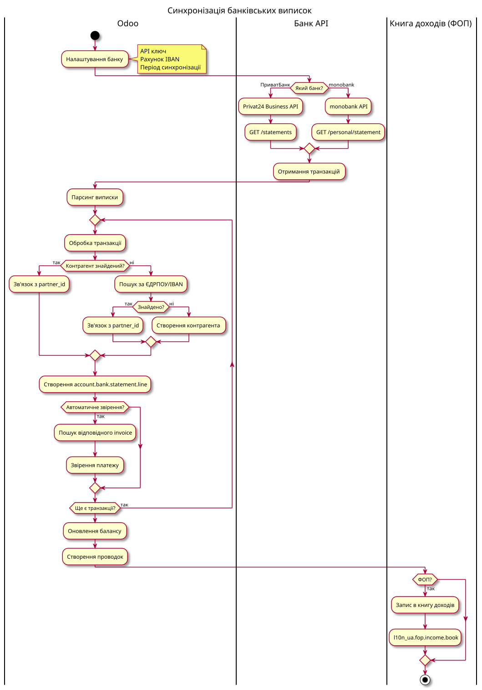

# Банки та платежі

← [Назад до головної](../README.md)

Легенда статусів: ✅ Стабільний · 🟢 Робочий · 🟡 Бета · 📦 Збірка

| Модуль | Версія | Статус | Призначення |
|--------|--------|--------|-------------|
| `l10n_ua_bank_sync` | 19.0.1.0.0 | 🟢 | Базова синхронізація з банками (конфіг, завдання, виписки, транзакції, правила співставлення) |
| `l10n_ua_bank_privat` | 19.0.1.0.0 | 🟢 | ПриватБанк (Автоклієнт Privat24 Business + legacy Merchant API) |
| `l10n_ua_bank_mono` | 19.0.1.0.0 | 🟢 | monobank (Personal Statement API) |
| `l10n_ua_bank_vst` | 19.0.1.0.0 | ✅ | VST Bank / Банк Восток (імпорт виписки iBank 2 UA CSV) + тести |
| `l10n_ua_bank_currency_sync` | 19.0.1.0.0 | ✅ | Курси валют (НБУ, ПриватБанк, monobank) + тести |
| `l10n_ua_payment_link` | 19.0.1.0.0 | 🟢 | QR-посилання НБУ + еквайринг monobank |

---

## l10n_ua_bank_sync — Базовий модуль

Залежності: `l10n_ua_account_base`, `mail`.

Фундамент для банківських інтеграцій. Провайдерні модулі (`_privat`, `_mono`) наслідують його моделі та реалізують виклики конкретних API.

| Модель | Призначення |
|--------|-------------|
| `l10n_ua.bank.sync.config` | Конфігурація підключення (провайдер, журнал, рахунок). Точки розширення: `_fetch_from_bank()`, `_parse_transactions()`, `action_test_connection()` |
| `l10n_ua.bank.sync.job` | Завдання синхронізації з машиною станів `draft → fetching → fetched → processing → done / error`. Зберігає сирий payload, дозволяє повторну обробку (`action_process`) без повторного завантаження з банку |
| `l10n_ua.bank.statement` | Імпортована виписка |
| `l10n_ua.bank.transaction` | Окрема транзакція; поля контрагента (назва, IBAN, ЄДРПОУ), `is_reconciled`, `matched_rule_id`. Метод `action_create_move()` створює проводку (правило дає рахунок-кореспондент, інакше транзитний рахунок) |
| `l10n_ua.bank.match.rule` | Правила авто-співставлення транзакцій (`check_match`) з рахунком, контрагентом і міткою |

Розширення: `res.bank` (код МФО), `res.partner.bank` (валідація IBAN), `account.journal` (прив'язка конфігу синхронізації).

Додатково: майстри синхронізації за довільний період та імпорту виписки, контролер експорту виписки у XLSX (`/l10n_ua_bank_sync/export_statement_xlsx/<id>`), QWeb-звіт виписки.

Тести: відсутні.

---

## l10n_ua_bank_privat — ПриватБанк

Залежності: `l10n_ua_bank_sync`.

Наслідує `l10n_ua.bank.sync.config`, додає провайдера `privat`. Реалізовано два реальні шляхи отримання виписок:

- **Автоклієнт (Privat24 Business)** — `_privat_fetch_autoclient()`, `GET https://acp.privatbank.ua/api/statements/transactions` із заголовком `token` та параметрами `startDate/endDate/acc`.
- **Legacy Merchant API** — `_privat_fetch_merchant()`, `https://api.privatbank.ua/p24api/rest_fiz`, XML-запит `cmt` за номером картки (для старих інтеграцій).

Вибір гілки — за наявністю токена або merchant-облікових даних. Підтримка корпоративних карток.

Тести: відсутні.

---

## l10n_ua_bank_mono — monobank

Залежності: `l10n_ua_bank_sync`.

Наслідує `l10n_ua.bank.sync.config`, додає провайдера `mono`. Реальна інтеграція з Personal API monobank:

- `_fetch_from_bank()` → `GET https://api.monobank.ua/personal/statement/{account}/{from}/{to}` із заголовком `X-Token`; обмеження API у 31 день та обробка `429` (rate limit).
- `_mono_get_default_account()` — автовизначення гривневого рахунку (валюта 980) через `/personal/client-info`.
- `_parse_transactions()` — суми з копійок у гривні, знак задає напрям (Дт/Кт), витягує назву/IBAN/ЄДРПОУ контрагента.
- `action_test_connection()`, `action_fetch_accounts()` — перевірка токена та перелік рахунків із балансами.

⚠️ Webhook: поле `mono_webhook_url` обчислюється (`/l10n_ua_bank_mono/webhook/<id>`) і є прапорець `mono_webhook_active`, але **контролер webhook у модулі не реалізований** — real-time оновлення поки заглушка. Синхронізація працює через опитування (fetch job).

Тести: відсутні.

---

## l10n_ua_bank_vst — VST Bank (iBank 2 UA)

Залежності: `l10n_ua_bank_sync`.

Файловий провайдер VST Bank (Банк Восток) — `provider = 'vst'`. Банк не опитується по API; виписка експортується з iBank 2 UA у CSV («Виписки по поточним рахункам», windows-1251, роздільник «;», з шапкою). Майстер **Імпорт виписки iBank 2 UA** (`l10n_ua.bank.vst.import`) приймає CSV-файл, створює завдання `l10n_ua.bank.sync.job` (`raw_payload = {'csv': ...}`, стан `fetched`) і запускає `action_process`. `_parse_transactions` розбирає рядки у стандартні транзакції: Дебет → від'ємна сума (Дт), Кредит → додатна (Кт), дата операції, кореспондент (назва / IBAN / ЄДРПОУ), призначення платежу — далі штатний конвеєр bank_sync (правила співставлення, проводки).

Зарплатний реєстр iBank 2 UA формується майстром зарплатного файлу у `l10n_ua_hr_salary` (формат `ibank2`). Банк доданий у `res.bank` (МФО 307123).

**Тести: наявні** — `tests/test_vst_import.py`, 5 сценаріїв (Дт/Кт зі знаком, пропуск шапки/порожніх, делегування іншим провайдерам, майстер→завдання).

---

## l10n_ua_bank_currency_sync — Курси валют

Залежності: `base`, `account`, `l10n_ua_bank_sync` (для меню «Банк UA»).

Синхронізація курсів із трьох джерел через модель `res.currency.rate.provider`:

- **НБУ** — `https://bank.gov.ua/NBUStatService/v1/statdirectory/exchange?json&date=YYYYMMDD` (офіційний курс).
- **ПриватБанк** — `https://api.privatbank.ua/p24api/pubinfo?json&exchange&coursid=N` (тип курсу налаштовується).
- **monobank** — `https://api.monobank.ua/bank/currency`.

Особливості: коректний перерахунок крос-курсу для компаній із не-гривневою валютою (`_uah_per_company_unit`, `_rate_vals`), запис у `res.currency.rate`, ручна та планова (cron) синхронізація, майстер синхронізації, історія курсів.

**Тести: наявні** — `tests/test_cross_rate.py`, 8 сценаріїв (реципрокність гривні, крос-курс для не-UAH компанії, ігнорування «сирих» котирувань, крос-курс monobank тощо).

---

## l10n_ua_payment_link — QR-платежі та еквайринг

Залежності: `l10n_ua_account_base`, `sale`.

Генерація платіжних посилань для рахунків (`account.move`) та замовлень (`sale.order`):

- **QR НБУ** — `nbu_payment_link` формується за шаблоном (`ir.config_parameter l10n_ua.nbu_qr_template`, Постанова НБУ №11 від 01.02.2021), кодується `base64url`, посилання `https://bank.gov.ua/qr/<payload>`. QR-код рендериться у SVG data-URI (`qrcode`).
- **Еквайринг monobank** — `action_create_mono_link()`: `POST https://api.monobank.ua/api/merchant/invoice/create` із токеном журналу (`mono_acquiring_token`), передає позиції рахунку та `webHookUrl`; зберігає `mono_payment_link` (pageUrl) і `mono_invoice_id`.
- **Webhook підтвердження оплати** — контролер `/l10n_ua_payment_link/mono/webhook`: за `invoiceId` і `status == 'success'` знаходить замовлення/рахунок та проводить оплату.

Розширення: `account.journal` (токен еквайрингу), `res.config.settings`, друкована форма рахунку з QR (`report_invoice_inherit`).

Тести: відсутні.
