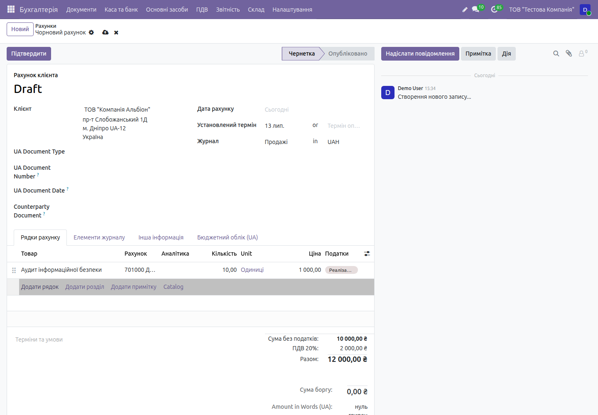
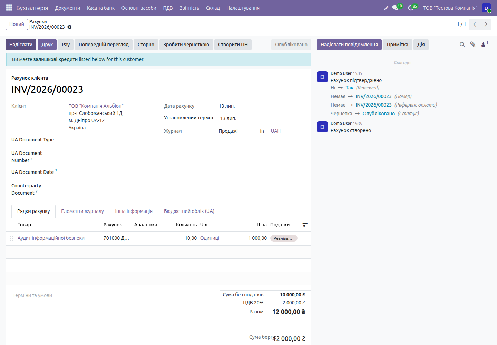
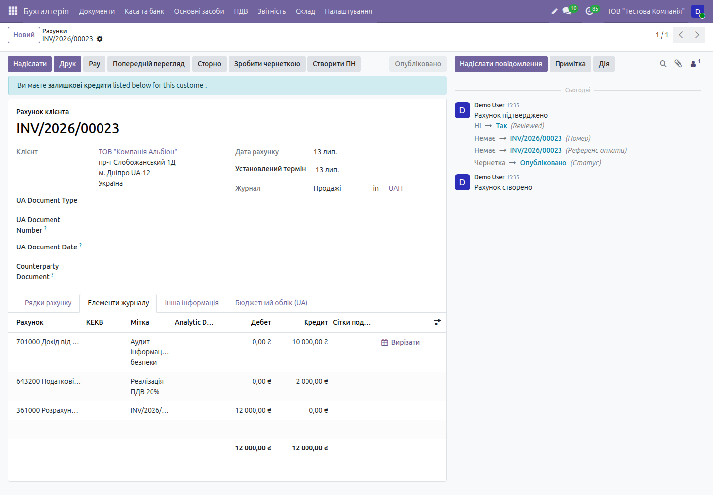
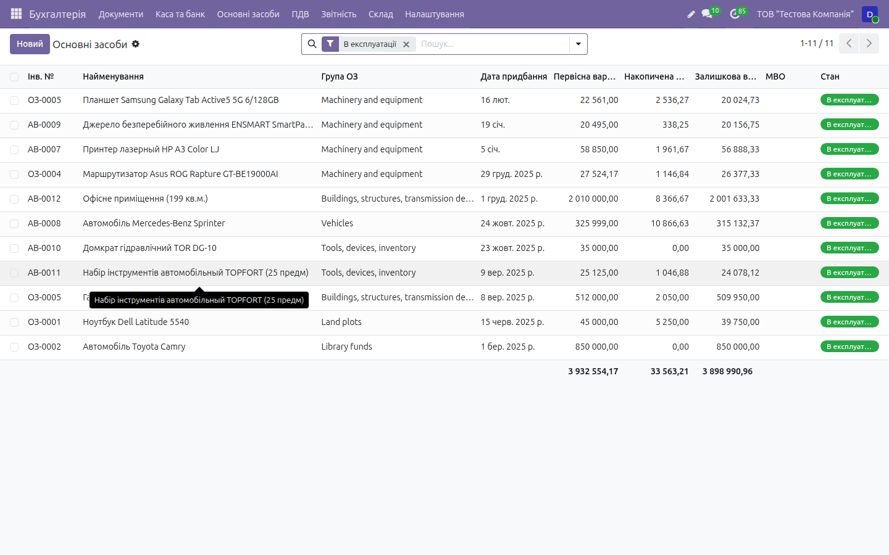
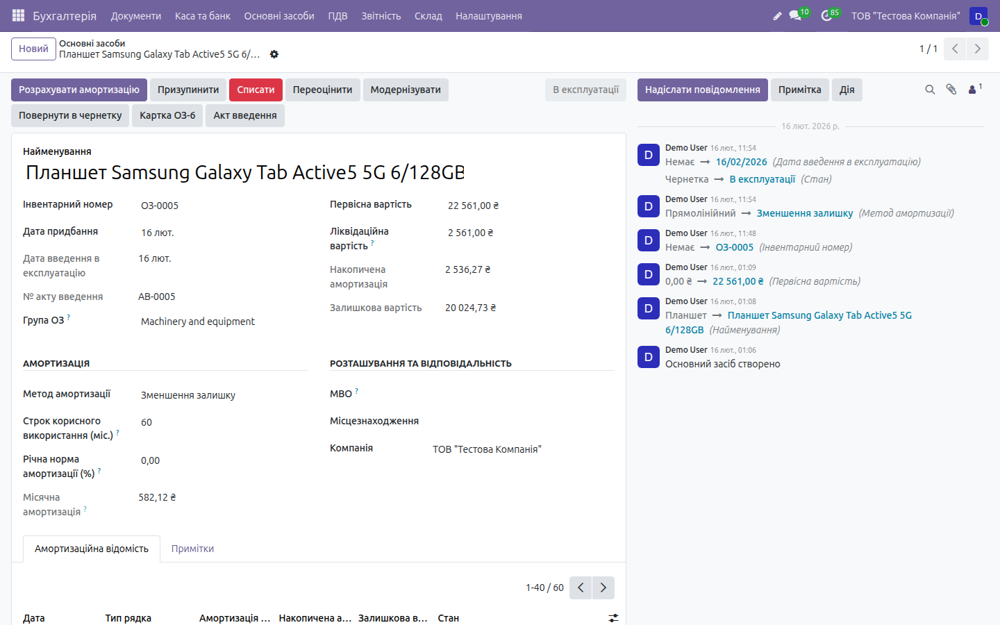
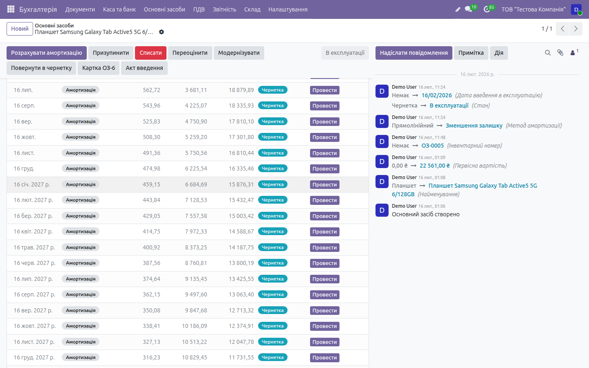
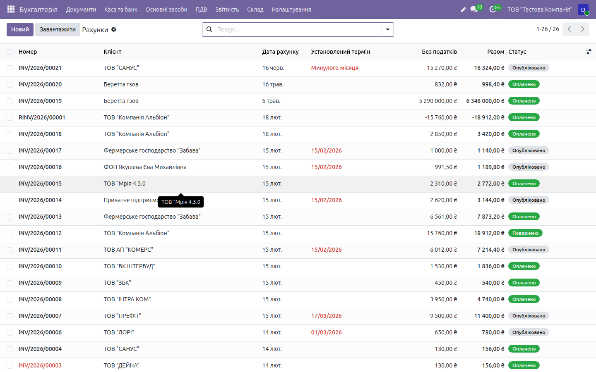

# HOWTO: Бухгалтерія — робочі флоу

← [Назад до документації](../../README.md) · [Опис домену](../core_accounting.md)

> Покрокові **робочі процеси** з реальним наповненням даних і результатами введення,
> виконані наживо на **[demo.ndev.online](https://demo.ndev.online)**
> (компанія _ТОВ «Тестова Компанія»_, вхід `demo`/`demo`). Кожен крок нижче реально
> пройдено — числа й проводки взято з фактично створених документів демо-бази.
> Дані на демо **не видаляються**, тож базу можна наповнювати під час тестування.
>
> Ролі та контрольні механізми (головбух, зарплатник, розрахунки, ТМЦ/ОЗ, касир) —
> див. `ACCOUNTING_UKRAINE.md`.

Скріншоти — у теці [`img/accounting/`](img/accounting/).

---

## Флоу 1. Order-to-Cash: продаж послуги з ПДВ

> Наскрізний процес «рахунок клієнту → проводки → ПДВ». Виконано наживо, результат —
> документ **INV/2026/00023**.

### Крок 1. Створити рахунок клієнта

**Бухгалтерія → Документи → кнопка `Новий`.** Відкриється чорновий рахунок у стані
**Чернетка**. Журнал за замовчуванням — **Продажі (UAH)**.

### Крок 2. Обрати клієнта

У полі **Клієнт** почніть вводити назву й оберіть контрагента зі списку — тут
**ТОВ «Компанія Альбіон»** (адреса й реквізити підтягуються з картки: пр-т Слобожанський 1Д,
м. Дніпро).

### Крок 3. Додати рядок номенклатури

На вкладці **Рядки рахунку** натисніть **`Додати рядок`** і заповніть:

| Поле | Значення |
|------|----------|
| Товар | Аудит інформаційної безпеки |
| Рахунок | 701000 «Дохід від реалізації» _(підставляється автоматично)_ |
| Кількість | 10 |
| Ціна | 1 000,00 |
| Податки | **ПДВ 20 % (Реалізація)** |

### Крок 4. Перевірити підсумок (результат введення)

Праворуч унизу система **одразу перерахує** підсумки:

| Показник | Сума |
|----------|-----:|
| Сума без податків | 10 000,00 ₴ |
| **ПДВ 20 %** | **2 000,00 ₴** |
| **Разом** | **12 000,00 ₴** |

Статус — досі **Чернетка** (проводок ще немає). «Amount in Words (UA)» показує суму прописом.

### Крок 5. Підтвердити рахунок

Натисніть **`Підтвердити`**. Результат:
- статус змінюється **Чернетка → Опубліковано**;
- документу присвоюється номер **INV/2026/00023**;
- формуються бухгалтерські проводки (див. крок 6);
- зʼявляється кнопка **`Створити ПН`** — генерація податкової накладної для ЄРПН.

### Крок 6. Перевірити проводки (Головна книга)

Вкладка **Елементи журналу** — автоматично сформована збалансована проводка:

| Рахунок | Дебет | Кредит |
|---------|------:|-------:|
| 361000 «Розрахунки з покупцями» | 12 000,00 | — |
| 701000 «Дохід від реалізації» | — | 10 000,00 |
| 643200 «Податкові зобов'язання з ПДВ 20 %» | — | 2 000,00 |
| **Разом** | **12 000,00** | **12 000,00** |

Тобто **Дт 361 — Кт 701, 643** (продаж із нарахуванням податкового зобов'язання з ПДВ).

### Крок 7. Податкова накладна та оплата

- **`Створити ПН`** формує податкову накладну (ставка 20 %) для реєстрації в ЄРПН
  (детально — у [HOWTO «Податки»](taxes.md));
- кнопка **`Зареєструвати оплату`** проводить надходження: статус рахунку →
  **Оплачено**, проводка **Дт 311 — Кт 361**, дебіторська заборгованість закривається.

> _Скриншот оплати:_ `13-invoice-payment.png`

---

## Флоу 2. Каса: ПКО / ВКО і касова книга

**Бухгалтерія → Каса та банк.**

1. **ПКО (Прибутковий касовий ордер, КО-1)** — надходження готівки: створіть платіж по
   касовому журналу типу «вхідний» → система формує ПКО з наскрізним номером; проводка
   **Дт 301 — Кт 361/661/…**;
2. **ВКО (Видатковий касовий ордер, КО-2)** — видача готівки (під звіт, виплата): платіж
   «вихідний» → ВКО; проводка **Дт 372/661/… — Кт 301**;
3. **Касова книга (КО-4)** за день/період формується автоматично; **ліміт залишку каси**
   контролюється системою.

> Українські ПКО/ВКО формуються лише для компаній із країною «Україна» (перевірено тестами
> — для іноземної компанії в мультикомпанійній базі не створюються).

> _Скриншоти:_ `20-cash-pko.png`, `21-cash-book.png`

---

## Флоу 3. Місяць-енд: амортизація ОЗ і проведення в Головну книгу

> Виконано наживо на картці **ОЗ-0005 «Планшет Samsung Galaxy Tab Active5»**.

### Крок 1. Список основних засобів

**Бухгалтерія → Основні засоби → Картки ОЗ.** Демо містить 12 ОЗ (разом первісна
3 954 177,17 ₴, знос 35 365,13 ₴, залишкова 3 918 812,04 ₴).

### Крок 2. Картка ОЗ і параметри амортизації

| Поле | Значення |
|------|----------|
| Первісна вартість | 22 561,00 ₴ |
| Ліквідаційна вартість | 2 561,00 ₴ |
| Метод амортизації | Зменшення залишку |
| Строк корисного використання | 60 міс. |
| Місячна амортизація | 582,12 ₴ |
| Накопичена амортизація | 2 536,27 ₴ |
| Залишкова вартість | 20 024,73 ₴ |

Кнопки: **Розрахувати амортизацію**, **Призупинити**, **Списати**, **Переоцінити**,
**Модернізувати**, **Картка ОЗ-6**, **Акт введення**.

### Крок 3. Провести місячну амортизацію

Вкладка **Амортизаційна відомість** містить помісячний графік. Приклад (перші місяці):

| Дата | Амортизація | Накопичена | Залишкова | Стан |
|------|------------:|-----------:|----------:|------|
| 16 лют. | 666,67 | 666,67 | 21 894,33 | **Проведено** |
| 16 бер. | 644,44 | 1 311,11 | 21 249,89 | **Проведено** |
| 16 квіт. | 622,96 | 1 934,07 | 20 626,93 | **Проведено** |
| 16 трав. | 602,20 | 2 536,27 | 20 024,73 | **Проведено** |
| 16 черв. | 582,12 | 3 118,39 | 19 442,61 | Чернетка → кнопка **`Провести`** |

Натисніть **`Провести`** на рядку-чернетці. Результат: формується проводка
**Дт рахунок витрат — Кт 131 «Знос ОЗ»** (дата = дата рядка), рядок стає **Проведено**,
накопичена амортизація й залишкова вартість оновлюються.

> **Передумова:** на **групі ОЗ** (або на картці) мають бути вказані журнал амортизації,
> рахунок витрат (Дт) і рахунок зносу (Кт 131) — інакше система повідомить, чого бракує.
> Кнопка **`Скасувати`** на проведеному рядку видаляє проводку.

### Крок 4. Закриття рахунків доходів/витрат

**Бухгалтерія → Звітність → Закриття періоду** — рахунки 791/792/793 закриваються на
441/442 (пошук рахунків фільтрується по компанії).

---

## Довідники та звітність

- **Рахунки клієнтів/постачальників:** Бухгалтерія → Документи (демо: 26 рахунків у станах
  Чернетка → Опубліковано → Оплачено/Повернено).
- **ОСВ (оборотно-сальдова відомість)**, **Журнали-ордери №1–7**, **Баланс (ф.1)**,
  **Звіт про фінрезультати (ф.2)** — Бухгалтерія → Звітність.

> _Скриншот ОСВ:_ `07-osv.png`

---

## Контрольний чек-лист флоу (звірено на демо)

- [x] **Order-to-Cash:** рахунок INV/2026/00023 — рядок 10 × 1 000 = 10 000 ₴ + ПДВ 20 % 2 000 ₴ = **12 000 ₴**
- [x] Підтвердження → статус **Опубліковано**, номер присвоєно
- [x] Проводки: **Дт 361 12 000 / Кт 701 10 000 / Кт 643 2 000** (баланс зійшовся)
- [x] Кнопка **Створити ПН** для ЄРПН доступна на проведеному рахунку
- [x] **Амортизація:** проведення рядка → Дт витрати / Кт 131; знос 2 536,27 ₴ = сума 4 проведених рядків
- [x] Залишкова вартість = первісна − накопичена амортизація
- [ ] Скриншоти оплати/каси/ОСВ (`13`, `20`, `21`, `07`) — догенерувати
