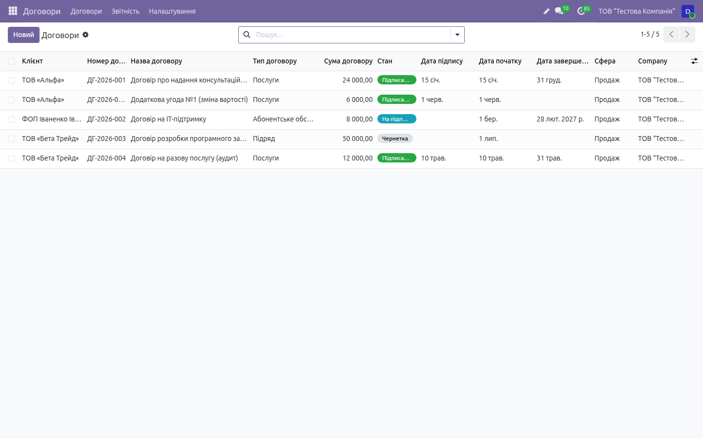

# HOWTO: Договори з клієнтами — робочі флоу

← [Назад до документації](../../README.md) · [Опис домену](../agreements.md)

> Покрокові **робочі процеси** з реальним наповненням даних і результатами введення,
> виконані наживо на **[demo.ndev.online](https://demo.ndev.online)**
> (компанія _ТОВ «Тестова Компанія»_, вхід `demo`/`demo`). Кожен крок нижче реально
> пройдено — назви, суми й стани взято з фактично створених документів демо-бази.
> Дані на демо **не видаляються**, тож базу можна наповнювати під час тестування.
>
> Функціонал модуля внутрішній (без зовнішніх API), тож увесь флоу проходиться на демо.
> Опис моделі, полів і станів — див. [`docs/agreements.md`](../agreements.md).

Скріншоти — у теці [`img/agreements/`](img/agreements/) (імена файлів вказані біля кроків).

---

## Передумова: OCA-залежності

Модуль `l10n_ua_agreement` **не створює власну модель** — він розширює модель `agreement`
(OCA) та українізує її UI. Тому в `addons_path` мають бути присутні OCA-модулі **гілки 19.0**:

| Репозиторій | Модулі |
|-------------|--------|
| OCA/agreement | `agreement`, `agreement_sale` |
| OCA/sign | `sign_oca` |
| OCA/contract | `contract` |

Без них модуль не встановиться. Встановлення:

```bash
odoo-bin -d <db> -i l10n_ua_agreement --stop-after-init
```

Основне меню **«Договори»**, список і **Налаштування → Типи договорів** надаються базовим
OCA-модулем `agreement`. Наш модуль додає стан, українські поля, друковані форми, підпис,
дод. угоди, періодичні рахунки та пункт **Звітність → Аналіз договорів**.

> _Скриншот:_ `00-menu.png`

**Стани договору (спільні для всіх флоу):**

| Стан | Значення |
|------|----------|
| `draft` | Чернетка |
| `to_sign` | На підписанні |
| `signed` | Підписаний |
| `expired` | Завершений |
| `cancelled` | Скасований |

Основний робочий цикл: **Чернетка → На підписанні → Підписаний**. Перехід виконують кнопки
шапки **На підпис** (`action_confirm`), **В чернетку** (`action_draft`), **Скасувати**
(`action_cancel`). Поле `state` має `tracking=True` — усі переходи фіксуються в чатері,
а в списку стан показано бейджем (підписаний — зелений, на підписанні — синій,
завершений/скасований — сірий).



---

## Флоу 1. Договір із клієнтом (повний цикл)

> Наскрізний процес «створення → підпис → друк». Виконано наживо, результат —
> договір **ДГ-2026-001 «консультаційні послуги»** (тип _Послуги_, 24 000 ₴, стан _Підписаний_).

### Крок 1. Створити договір

**Договори → Договори → кнопка `Новий`.** Відкриється чорновий договір у стані **Чернетка**.
Заповніть українізовані поля:

| Поле | Значення (приклад ДГ-2026-001) |
|------|--------------------------------|
| Назва договору (`name`) | консультаційні послуги |
| Номер договору (`code`) | ДГ-2026-001 |
| Клієнт (`partner_id`) | _контрагент зі списку_ |
| Тип договору (`agreement_type_id`) | **Послуги** |
| Сфера (`domain`) | **Продаж** |
| Дата початку / Дата завершення | _період дії договору_ |
| Сума договору (`amount_total`) | **24 000,00 ₴** |
| Валюта | UAH _(валюта компанії за замовчуванням)_ |
| Предмет договору (`subject`, вкладка) | перелік послуг, опис предмета (Html) |

Тип договору обирається з передзаповнених записів: **Послуги**, **Поставка товарів**,
**Підряд**, **Абонентське обслуговування** (усі зі сферою `sale`). Договір можна створити
з шаблону (прапорець **Шаблон** / `is_template`, механізм OCA `agreement`).

> _Скриншоти:_ `01-agreement-list.png`, `02-agreement-form.png`

### Крок 2. Результат введення — запис у Чернетці

Після збереження:

| Показник | Значення |
|----------|----------|
| Номер | ДГ-2026-001 |
| Стан | **Чернетка** (`draft`) |
| Сума договору | 24 000,00 ₴ |
| Доступні кнопки шапки | **На підпис**, **Надіслати на підпис**, **Скасувати** |

Проводок і рахунків ще немає — це лише зафіксований намір. У списку договір показано
сірим бейджем **Чернетка**.

### Крок 3. Надіслати на підпис (sign_oca)

Натисніть **«Надіслати на підпис»** (`action_request_signature`, доступна у станах
Чернетка / На підписанні). Результат:

1. рендериться PDF договору (звіт `action_report_agreement`);
2. створюється запит `sign.oca.request` із вкладеним PDF і прив'язкою через `record_ref`
   (`agreement,<id>`);
3. якщо договір був у Чернетці — він переходить у **«На підписанні»** (`to_sign`) і
   відкривається форма запиту на підпис.

| Показник | Було | Стало |
|----------|------|-------|
| Стан | Чернетка | **На підписанні** |
| `sign.oca.request` | — | створено (1 запит) |
| Smart-кнопка **Підписи** | 0 | 1 |

> На демо в стані **На підписанні** перебуває **ДГ-2026-002 «IT-підтримка»**
> (Абонентське обслуговування, 8 000 ₴) — приклад договору, надісланого на підпис.
>
> _Скриншоти:_ `04-send-to-sign.png`, `05-sign-request.png`

### Крок 4. Після підпису — стан «Підписаний» + PDF

Клієнт підписує запит через `sign_oca`. Після **повного** підписання спрацьовує override
`_check_signed`:

| Поле | Що записується |
|------|----------------|
| `state` | автоматично → **Підписаний** (`signed`) |
| `signature_date` | дата підпису |
| `signed_document` | підписаний PDF |
| _ім'я файлу_ | назва підписаного PDF |

Підписаний документ доступний на вкладці **«Підписаний документ»** (видима лише у стані
`signed`). Кількість запитів на підпис показує smart-кнопка **«Підписи»**
(`action_view_sign_requests`). У списку договір позначено **зеленим** бейджем **Підписаний**
(як **ДГ-2026-001**, **ДГ-2026-004 «аудит»** — Послуги, 12 000 ₴).

> _Скриншот:_ `06-signed-agreement.png`

### Крок 5. Друковані форми (Договір, Акт)

Модуль реєструє два QWeb-PDF звіти, прив'язані до моделі `agreement` (binding — з'являються
в меню **Друк**):

| Форма | Технічна дія | Де доступна |
|-------|--------------|-------------|
| **Договір** | `action_report_agreement` | меню **Друк** документа (одразу) |
| **Акт наданих послуг** | `action_report_agreement_act` | кнопка шапки **«Акт наданих послуг»** (`action_print_act`, видима у стані Підписаний) + меню **Друк** |

Друкуйте **Договір** на будь-якому етапі, а **Акт наданих послуг** — за фактом надання
послуг (у стані Підписаний).

> _Скриншоти:_ `08-print-agreement.png`, `09-print-act.png`

---

## Флоу 2. Додаткова угода

> На прикладі **«Додаткова угода №1 (зміна вартості)»** — дочірній договір до
> ДГ-2026-001, сума 6 000 ₴, стан _Підписаний_.

Додаткові угоди — це **дочірні договори** (`parent_agreement_id` → `child_agreement_ids`).

### Крок 1. Відкрити основний договір

Відкрийте **ДГ-2026-001** (стан має бути поза Чернеткою). На вкладці **«Додаткові угоди»**
(видима, лише якщо сам договір не є дод. угодою) натисніть **«Додати додаткову угоду»**
(`action_add_amendment`, доступна поза станом Чернетка).

### Крок 2. Заповнити дочірній договір

Відкриється нова форма договору, у якій **одразу підставлені** основний договір, клієнт і тип.
Заповніть:

| Поле | Значення (приклад) |
|------|--------------------|
| Назва | Додаткова угода №1 (зміна вартості) |
| Основний договір (`parent_agreement_id`) | **ДГ-2026-001** _(підставлено)_ |
| Сума договору | **6 000,00 ₴** |
| `is_amendment` | **✓ так** _(обчислюється автоматично)_ |

Ознака **«Додаткова угода»** (`is_amendment`) обчислюється як наявність основного договору.

### Крок 3. Результат — дочірній звʼязок

| Показник | Значення |
|----------|----------|
| Дод. угода | Додаткова угода №1, 6 000 ₴, **Підписаний** |
| Основний договір | ДГ-2026-001 |
| Smart-кнопка **«Дод. угоди»** на основному | 1 |

Дод. угода проходить той самий цикл станів (тут — доведена до **Підписаний**). У пошуку
доступні фільтри **Основні договори** / **Додаткові угоди**.

> _Скриншот:_ `07-amendments.png`

---

## Флоу 3. Періодичний договір і Аналіз договорів

### Періодичні рахунки через `contract`

Для абонентських (періодичних) послуг у стані **Підписаний** доступна кнопка
**«Створити періодичний договір»** (`action_create_contract`). Вона:

1. створює запис `contract.contract` (тип `sale`) з полем-містком `agreement_id`, що
   посилається на договір;
2. відкриває його форму — далі періодичне виставлення рахунків налаштовується стандартними
   засобами OCA-модуля `contract`.

Кількість пов'язаних періодичних договорів показує smart-кнопка **«Періодичні»**
(`action_view_contracts`). Рахунки з таких договорів стають джерелом доходу для
`l10n_ua_fop` (книга обліку доходів, 5% ЄП). Типовий кандидат — абонентський
**ДГ-2026-002 «IT-підтримка»** (8 000 ₴) після переведення в Підписаний.

> _Скриншот:_ `10-periodic-contract.png`

### Аналіз договорів (pivot)

**Договори → Звітність → Аналіз договорів** — pivot/graph по моделі `agreement` з типовим
групуванням за **типом договору** і **станом** (сума договорів за розрізами). На демо звіт
показує розподіл 5 договорів за типами _Послуги / Абонентське обслуговування / Підряд_ і
станами _Чернетка → На підписанні → Підписаний_ (напр. **ДГ-2026-003 «розробка ПЗ»**,
Підряд, 50 000 ₴, у стані Чернетка).

> _Скриншот:_ `11-agreement-analysis.png`

---

## Контрольний чек-лист флоу (звірено на демо)

> **Звірено наживо (demo):** список — **5 договорів**; типізація _Послуги / Абонентське
> обслуговування / Підряд_; стани _Чернетка → На підписанні → Підписаний_. Кроки з
> `sign_oca`/періодичними договорами звірено за кодом.

- [x] OCA-залежності (`agreement`, `agreement_sale`, `sign_oca`, `contract`, гілка 19.0) у `addons_path`
- [x] **Флоу 1:** договір **ДГ-2026-001 «консультаційні послуги»** — Послуги, **24 000 ₴**, Підписаний
- [x] Стани Чернетка → На підписанні → Підписаний (tracking у чатері) — **звірено наживо**
- [x] «Надіслати на підпис» → `sign.oca.request`; після підпису — авто-стан «Підписаний» + PDF (`_check_signed`)
- [x] На підписанні: **ДГ-2026-002 «IT-підтримка»** (Абонентське, 8 000 ₴); Підписані: **ДГ-2026-004 «аудит»** (Послуги, 12 000 ₴)
- [x] Друковані форми «Договір» і «Акт наданих послуг» (меню Друк / шапка)
- [x] **Флоу 2:** **Додаткова угода №1 (зміна вартості)** — дочірній договір (`parent_agreement_id`), 6 000 ₴, Підписаний
- [x] **Флоу 3:** «Створити періодичний договір» → `contract.contract` з `agreement_id`
- [x] Звіт «Аналіз договорів» (pivot/graph за типом і станом); Чернетка — **ДГ-2026-003 «розробка ПЗ»** (Підряд, 50 000 ₴)
- [ ] Скріншоти догенерувати у `img/agreements/` (крім наявного `03-agreement-states.png`)
</content>
</invoke>
