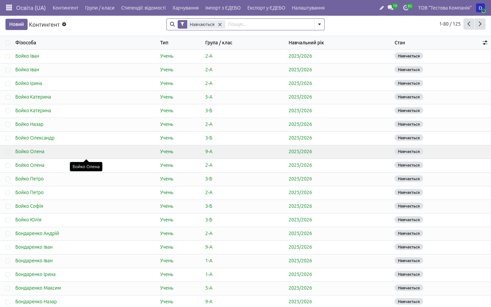
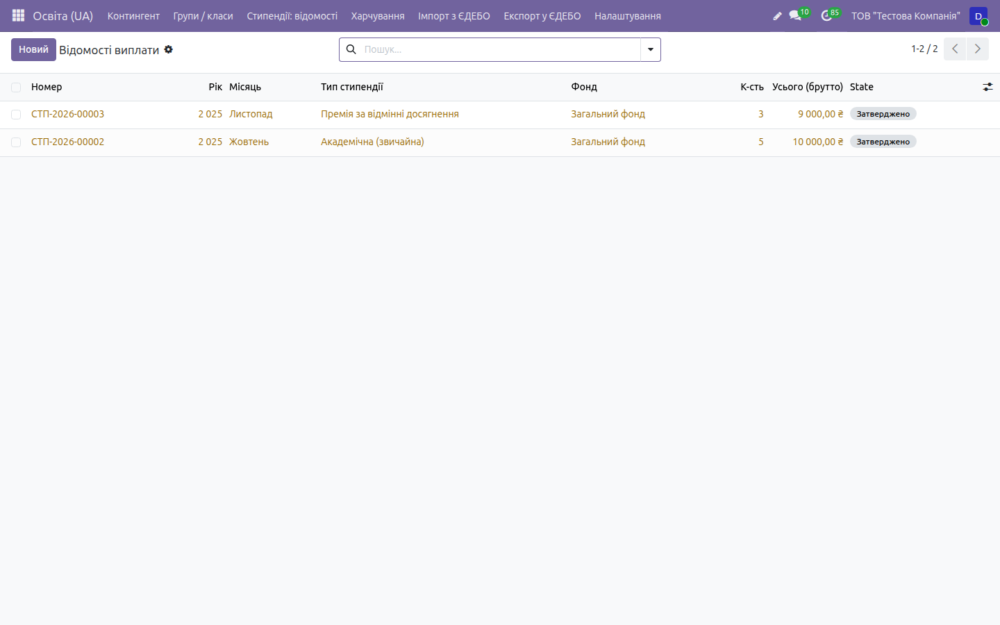

# HOWTO: Заклади освіти — робочі флоу

← [Назад до документації](../../README.md) · [Опис домену](../education.md)

> Покрокові **робочі процеси** з реальним наповненням даних і результатами введення,
> виконані наживо на **[demo.ndev.online](https://demo.ndev.online)**
> (компанія _ТОВ «Тестова Компанія»_, вхід `demo`/`demo`). Кожен крок нижче реально
> пройдено — числа й стани взято з фактично створених документів демо-бази.
> Дані на демо **не видаляються**, тож базу можна наповнювати під час тестування.
>
> ⚠️ **Домен у стадії 🟡 бета.** Контингент і стипендії — робочі й покриті тестами;
> харчування — **скелет без пільгових/безоплатних категорій**, ЄДЕБО — **інфраструктурний
> каркас**. Перед роботою прочитайте розділ [«Поточний стан»](#поточний-стан) — там чесно
> перелічено, що вже працює, а що ще ні.

Скріншоти — у теці [`img/education/`](img/education/).

---

## 0. Застосунок домену

Меню застосунків (сітка ▤ ліворуч угорі) → **Освіта (UA)**. Верхнє меню модуля:

| Пункт | Призначення |
|-------|-------------|
| **Контингент** | Учні / студенти / вихованці, їхній life-cycle |
| **Групи / класи** | Групи, класи, курси, привʼязані до навчального року |
| **Стипендії: відомості** | Відомості нарахування та виплати стипендій |
| **Харчування** → Меню, Відвідуваність | Дитяче харчування (ЗДО/школи) |
| **Імпорт з ЄДЕБО** / **Експорт у ЄДЕБО** | Обмін контингентом (каркас) |
| **Налаштування** → Навчальні роки, Типи стипендій, Технологічні картки | Довідники |

### Налаштування закладу освіти (на картці компанії)

Тип закладу задається на **картці компанії** (`res.company`), а не в модулі. Відкрийте
**Налаштування → Користувачі та компанії → Компанії → картка вашої установи** і заповніть
поля, додані модулем `l10n_ua_education_base`:

| Поле (`res.company`) | Значення (приклад) | Призначення |
|-----------------------|--------------------|-------------|
| `l10n_ua_education_type` (Тип закладу освіти) | **ЗВО III–IV рівнів** (`zvo_3_4`) | ЗДО / ЗЗСО / ліцей / ПТУ / ЗВО I–II / ЗВО III–IV / позашкільний / інше — впливає на доступні види груп і рівні |
| `l10n_ua_education_is_state` (Державний / комунальний) | ✔ | форма власності — впливає на казначейське обслуговування (`l10n_ua_budget_treasury`) |
| `l10n_ua_education_license_number` (Номер ліцензії) | напр. `ЛО-12345` | номер ліцензії на освітню діяльність |
| `l10n_ua_education_license_date` (Дата видачі ліцензії) | 2020-08-25 | дата видачі ліцензії |
| `l10n_ua_education_iea_code` (Код ЄДЕБО) | напр. `E19008000` | унікальний ідентифікатор закладу в ЄДЕБО — використовується при обміні контингентом |

> Для не-освітніх компаній ці поля лишаються порожніми. Тип закладу й `is_state` визначають
> набір документів і казначейську логіку; **код ЄДЕБО (`iea_code`)** — обов'язкова передумова
> майбутнього файлового обміну з ЄДЕБО.
>
> _Скриншот:_ `03-company-education.png`

Навчальний рік і групи — передумова роботи з контингентом:

- **Освіта (UA) → Налаштування → Навчальні роки** (`l10n_ua.education.academic.year`):
  назва у форматі «2025/2026», `year_end` обчислюється автоматично, **активним може бути
  лише один рік** (система контролює), дати перевіряються на коректність;
- **Освіта (UA) → Групи / класи** (`l10n_ua.education.group`): рівень, профіль, привʼязка
  до навчального року (за замовчуванням успадковує активний), лічильник членів.

> _Скриншоти:_ `00-apps-menu.png`, `01-academic-years.png`, `02-groups.png`

---

## Флоу 1. Контингент — зарахування учня

> Наскрізний процес «заява абітурієнта → зарахування → навчання». Картка учня
> (`l10n_ua.education.contingent.member`) проходить керований life-cycle, стани **не можна
> «перестрибувати»**:
>
> ```
> Заявник (applicant) → Зараховано (enrolled) → Навчається (studying)
>                                                    ↕ Академвідпустка (on_leave)
>                          → Випущено (graduated) / Відраховано (expelled) / Переведено (transferred)
> ```
>
> Академвідпустка (`on_leave`) — окремий проміжний стан між «Навчається» і завершенням; детально
> у [Флоу 1-а](#флоу-1-а-академвідпустка-take_leave--return_from_leave).
>
> На демо цей процес пройдено для **125 учнів** (класи 1-А…9-Б, навч. рік 2025/2026,
> стан «Навчається»).

### Крок 1. Створити картку учня

**Освіта (UA) → Контингент → кнопка `Новий`.** Заповніть картку:

| Поле | Значення (приклад) |
|------|--------------------|
| Фізособа (партнер) | Іваненко Іван Іванович _(привʼязка до `res.partner`)_ |
| Тип | Учень |
| Група / клас | 5-А |
| Навчальний рік | 2025/2026 _(підставляється активний)_ |
| Номер студента | присвоюється, **унікальний у межах компанії** |
| Дата подання заяви | 2025-06-15 |

Опційно картку можна привʼязати до `hr.employee`. Картка має чатер (`mail.thread`) для
історії й активностей.

### Крок 2. Перевірити стан (результат введення)

Після збереження нова картка отримує стартовий стан **Заявник** (`applicant`). У статусній
панелі вгорі доступні кнопки переходів, проводки/нарахувань ще немає.

| Показник | Значення |
|----------|----------|
| Стан | **Заявник** |
| Номер студента | присвоєно (унікальний) |
| Дата подання заяви | зафіксовано |

### Крок 3. Зарахувати учня

Кнопкою статусної панелі проведіть картку по станах:

- **`Зарахувати`** → стан **Заявник → Зараховано** (`enrolled`), фіксується **дата
  зарахування**;
- **`Розпочати навчання`** → стан **Зараховано → Навчається** (`studying`).

> **Правила life-cycle (перевірено тестами):** перехід одразу на кінцевий стан в обхід
> проміжних **заборонено**. Відрахувати (`expelled`) можна навіть з етапу «Заявник».
> З «Навчається» доступні кінцеві стани **Випущено / Відраховано / Переведено**.

### Крок 4. Результат — учень у контингенті

Учень зі станом **Навчається** зʼявляється у загальному списку контингенту. На демо список
містить **125 учнів** (класи 1-А…9-Б, навч. рік 2025/2026), кожен — активний член контингенту.



> _Ще скриншот:_ `04-contingent-form.png` (картка учня з панеллю life-cycle)

---

## Флоу 1-а. Академвідпустка (take_leave / return_from_leave)

> Стан **Академвідпустка** (`on_leave`) фіксує тимчасове припинення навчання (за станом
> здоров'я, сімейними обставинами, призовом тощо — Закон «Про вищу освіту», порядок надання
> академвідпустки за Наказом МОН). Лайф-цикл **не перестрибує** цей стан: увійти в нього можна
> лише зі стану «Навчається», а вийти — назад у «Навчається» або у «Відраховано».

### Крок 1. Відправити студента в академвідпустку

На картці учня зі станом **Навчається** (`studying`) натисніть у статусній панелі кнопку
**`Академвідпустка`** (`action_take_leave`).

| Показник | До | Після |
|----------|----|-------|
| Стан | Навчається (`studying`) | **Академвідпустка (`on_leave`)** |
| Кнопки панелі | Академвідпустка / Випустити / Відрахувати / Перевести | **Повернути з відпустки** / Відрахувати |

> Дії з датою переходу тут **не фіксується окремим полем** (`action_take_leave` лише змінює
> стан). Номер наказу про надання академвідпустки окремою моделлю **не ведеться** — як і решта
> «наказів» у домені, це поки що лише перехід стану (див. розділ «Поточний стан»).

### Крок 2. Повернути студента з відпустки

Кнопкою **`Повернути з відпустки`** (`action_return_from_leave`) картка повертається
`on_leave → studying`. Після повернення знову доступні всі робочі дії (стипендії,
відвідуваність харчування, випуск).

### Правила переходів (перевірено `_can_transition`)

- увійти в `on_leave` можна **лише зі `studying`** — кнопка «Академвідпустка» видима тільки в
  цьому стані (`invisible="state != 'studying'"`);
- зі `on_leave` дозволено **лише** `studying` (повернення) або `expelled` (відрахування);
- **випуск (`graduated`) безпосередньо з академвідпустки заборонено** — кнопка «Випустити»
  видима тільки у `studying`; щоб випустити студента, спершу поверніть його з відпустки;
- у статусній панелі `statusbar_visible="applicant,enrolled,studying,graduated"` — `on_leave`
  показується як **додатковий («випадаючий») стан**, а не як основний етап панелі.

> _Скриншот:_ `05-member-on-leave.png`

---

## Флоу 2. Стипендії — нарахування відомості

> Процес «створити відомість → додати студентів → затвердити з утриманням податків».
> Виконано наживо: на демо дві затверджені відомості — **«Академічна (звичайна)»** (5 осіб,
> разом 10 000 ₴) і **«Премія за відмінні досягнення»** (3 особи, разом 9 000 ₴).

### Крок 1. Створити відомість

**Освіта (UA) → Стипендії: відомості → кнопка `Новий`** (`l10n_ua.scholarship.payment`).
Заповніть шапку:

| Поле | Значення (приклад «Академічна») |
|------|----------------------------------|
| Номер | присвоюється послідовністю |
| Навчальний рік / місяць | 2025/2026, вересень |
| Тип стипендії | Академічна _(з довідника `l10n_ua.scholarship.type`)_ |
| КЕКВ | **2720** _(підставляється з типу за замовчуванням)_ |
| Бюджетний фонд | обирається; опційно КПКВК |

Тип стипендії несе **ознаку оподаткування** та **КЕКВ за замовчуванням**. Довідник типів
(**Налаштування → Типи стипендій**) містить: академічна, соціальна, президентська, іменна,
стипендія Верховної Ради, обласна.

Стани відомості:

```
Чернетка (draft) → Затверджено (approved) → Виплачено (paid) → Скасовано (cancelled)
```

### Крок 2. Додати студентів (рядки відомості)

На вкладці рядків додайте по одному члену контингенту (`l10n_ua.scholarship.payment.line`):

- домен вибору — **лише активні студенти** (стан «Навчається»);
- **без дублювання** члена в межах однієї відомості;
- **відʼємна сума заборонена**;
- для **оподатковуваних** типів автоматично рахуються **ПДФО (18 %)** і **ВЗ (5 %)**; для
  неоподатковуваних податок = 0.

Приклад для відомості «Академічна (звичайна)» — 5 студентів по 2 000 ₴.

### Крок 3. Перевірити підсумок (результат введення)

Система підсумовує рядки. Фактичні відомості демо:

| Відомість | Осіб | Сума нарахування | КЕКВ | Стан |
|-----------|-----:|-----------------:|:----:|------|
| **Академічна (звичайна)** | 5 | **10 000,00 ₴** | 2720 | Затверджено |
| **Премія за відмінні досягнення** | 3 | **9 000,00 ₴** | 2720 | Затверджено |



### Крок 4. Затвердити відомість

Натисніть **`Затвердити`**. Результат:

- статус змінюється **Чернетка → Затверджено**;
- для оподатковуваних типів фіксуються **утримання ПДФО 18 % та ВЗ 5 %** по кожному рядку;
- витрати відносяться на **КЕКВ 2720**;
- якщо встановлено `l10n_ua_budget_treasury` — при проведенні **контролюється ліміт
  розпорядника**.

> **Контрольні правила (перевірено тестами):** **порожню відомість затвердити не можна**
> (`action_approve` кидає помилку на порожньому `line_ids`); **оплачену (paid) — скасувати не
> можна** (`action_cancel` кидає помилку — лише сторнування).

### Крок 5. Провести виплату (нарахування → `account.move`)

Натисніть **`Виплатити`** (`action_pay`, доступно **лише зі стану `approved`**). Логіка:

1. якщо на відомості **заповнено «Журнал нарахування»** (`journal_id`) — викликається
   `_create_account_move()`, що створює й **проводить** (`action_post`) бухгалтерську проводку
   типу `entry`; посилання зберігається у полі **«Згенерована проводка»** (`account_move_id`);
2. стан змінюється **Затверджено → Виплачено** (`approved → paid`).

**Структура проводки** (`_create_account_move`, суми агрегуються по всій відомості):

| Дт / Кт | Рахунок (поле) | Сума | Призначення |
|---------|----------------|------|-------------|
| **Дт** | Рахунок витрат `account_expense_id` — **8011** (нерозпорядники) / **8111** (розпорядники) | брутто | нарахування стипендій |
| **Кт** | Рахунок розрахунків зі студентами `account_payable_id` — **6514** | нетто (брутто − ПДФО − ВЗ) | до виплати студентам |
| **Кт** | ПДФО `account_pdfo_id` | сума ПДФО (18 %) | якщо ПДФО > 0 і рахунок вказано |
| **Кт** | Військовий збір `account_vz_id` | сума ВЗ (5 %) | якщо ВЗ > 0 і рахунок вказано |

У кожен рядок проводки проставляється **аналітика**: КЕКВ (`ua_kekv_id`), тип фонду
(`ua_fund_type`), КПКВК (`ua_kpkvk_id`). При встановленому `l10n_ua_budget_treasury` — при
проведенні **контролюється казначейський ліміт розпорядника**.

> **Застереження:** без заповненого журналу дія `action_pay` лише переводить стан у `paid`
> **без** створення проводки. Якщо журнал є, але не заповнено рахунки витрат/розрахунків —
> `_create_account_move` кидає помилку. Оплачену відомість повернути в чернетку не можна
> (`action_reset_to_draft` працює лише для `approved`/`cancelled`).

### Соціальна стипендія (EDU-16)

Соціальні відомості створюються **так само**, лише **тип стипендії — «Соціальна»**
(`l10n_ua.scholarship.type`, `kind = social`; ПКМУ №1050 від 28.12.2016 — діти-сироти,
малозабезпечені, УБД та їхні діти тощо). Особливості:

- ознака оподаткування (`is_taxable_pdfo`) і КЕКВ/фонд беруться **з обраного типу** й можуть
  відрізнятися від академічної;
- **окремого довідника пільгових категорій-підстав соціальної стипендії НЕМАЄ** — категорія
  отримувача не кодується, тип «Соціальна» обирається **вручну**, коло осіб визначає бухгалтер.

### ⚠️ Ліміт стипендіатів за рейтингом — [НЕ РЕАЛІЗОВАНО] (EDU-19)

Порядок призначення академічних стипендій (**ПКМУ №1050 / №1051 від 28.12.2016**) вимагає
**рейтингування** студентів і **обмеження частки стипендіатів** (орієнтовно ~40–45 % за
рейтингом успішності). У системі **немає ані моделі рейтингу, ані ліміту стипендіатів, ані
авторозрахунку кола отримувачів**.

**Як робити зараз (обхід вручну):** бухгалтер/деканат формує коло стипендіатів **поза
системою** (рейтингова відомість факультету), після чого **вручну** додає обраних студентів
рядками у відомість `l10n_ua.scholarship.payment`. Єдиний вбудований обмежувач суми —
казначейський ліміт розпорядника (Крок 5), який **не пов'язаний із рейтингом**.

---

## Флоу 3. Обмін з ЄДЕБО (каркас) — 🟡 стисло

> ⚠️ **Чесно:** це **інфраструктурний каркас**, а не готовий обмін. Специфікація форматів
> ЄДЕБО **закрита** й регулярно оновлюється; конкретні формати підключаються плагінами.

### Крок 1. Імпорт контингенту

**Освіта (UA) → Імпорт з ЄДЕБО** (візард `l10n_ua.edebo.import`): завантаження
студентів/учнів з **CSV / XLSX**. Є **режим сухого прогону (dry-run)** — перевірка без
створення записів — і режим реального створення членів контингенту. Точка розширення
`_parse_custom()` — під власні формати обміну.

### Крок 2. Експорт контингенту

**Освіта (UA) → Експорт у ЄДЕБО** (візард `l10n_ua.edebo.export`): вивантаження контингенту
в **CSV** (лише активні члени).

### Крок 3. XML-плагін (`l10n_ua_education_edebo_xml`)

Окремий модуль-плагін переозначує `_parse_custom()` для формату `custom` і парсить **XML** за
структурою `<edebo><students><student>…` з підтримкою синонімів тегів (`TAG_SYNONYMS`).
Структуру переозначують у дочірньому модулі під реальний контракт МОН.

- вибір формату `custom` **без встановленого плагіна** дає помилку (перевірено тестами);
- **експорт у XML ще не реалізовано** (потребує цифрового підпису — окремий PR).

> _Скриншоти (плейсхолдери):_ `11-edebo-import.png`, `12-edebo-export.png`

---

## Флоу 4. Харчування (meals) — 🟡 скелет, стисло

> ⚠️ **Читайте уважно.** Модуль `l10n_ua_education_meals` — **скелет без автотестів**. Він
> **не має пільгових / безоплатних категорій харчування**. Використовуйте для меню й обліку
> порцій, але **не для повного розрахунку пільгового харчування**.

**Освіта (UA) → Харчування.**

### Крок 1. Технологічні картки страв

**Налаштування → Технологічні картки** (`l10n_ua.meal.recipe` +
`l10n_ua.meal.recipe.ingredient`) — рецепти страв із переліком інгредієнтів.

### Крок 2. Щоденне меню

**Харчування → Меню** (`l10n_ua.meal.menu` + `l10n_ua.meal.menu.line`): вікова група, вид
прийому їжі (сніданок / обід / полуденок / вечеря), автоматичне підсумовування **КБЖВ**
(калорії, білки, жири, вуглеводи). Стан: `draft → approved`.

### Крок 3. Відвідуваність

**Харчування → Відвідуваність** (`l10n_ua.meal.attendance`): присутні / відсутні по
групі-класу, кількість порцій за прийомами їжі — для розрахунку фактичної кількості.

### Чого поки НЕМАЄ (чесно)

- **немає пільгових / безоплатних категорій харчування** — облік ведеться лише за загальною
  кількістю порцій і видом прийому їжі; розподіл платні / пільгові / безоплатні (діти
  пільгових категорій за ПКМУ) **не підтримується** (є окремий issue);
- **модель добових вікових норм `l10n_ua.meal.norm` не реалізована** (згадана в маніфесті,
  але моделі й подання немає);
- **немає автотестів** для цього модуля.

> _Скриншоти (плейсхолдери):_ `08-meal-recipe.png`, `09-meal-menu.png`, `10-meal-attendance.png`

---

## Поточний стан

Домен **🟡 бета**. Що реально працює й покрито тестами, а що ні:

| Складова | Стан | Тести |
|----------|------|-------|
| `l10n_ua_education_base` (контингент, роки, групи) | 🟢 робочий | 11 тестів |
| `l10n_ua_education_scholarship` (стипендії) | 🟢 робочий | 11 тестів |
| `l10n_ua_education_edebo` (CSV/XLSX-каркас) | 🟢 каркас | 6 тестів |
| `l10n_ua_education_edebo_xml` (XML-плагін) | 🟢 каркас | 5 тестів |
| `l10n_ua_education_meals` (харчування) | 🟡 **скелет** | **немає тестів** |

**Чесні застереження:**

- **ЄДЕБО — це каркас, а не готовий обмін.** Реальні формати закриті; вбудована XML-структура
  є робочим прикладом, який переозначується під контракт МОН. Експорт у XML ще не готовий
  (потребує КЕП), **зовнішнього API-обміну немає** — лише файловий CSV/XML.
- **Ліміт стипендіатів за рейтингом (ПКМУ №1050/№1051) — НЕ реалізовано.** Немає моделі
  рейтингу, ліміту частки стипендіатів (~40–45 %) й авторозрахунку кола отримувачів — відомість
  наповнюється **вручну** (див. EDU-19 у Флоу 2).
- **«Накази» — це не документи.** Зарахування/академвідпустка/відрахування/переведення/випуск
  зводяться до переходів стану + текстових полів номерів; окремої моделі наказу, автонумерації,
  шаблонів і друкованих форм (як `hr.order` у HR-блоці) **немає**.
- **Харчування без пільгових/безоплатних категорій.** Немає розподілу порцій на платні /
  пільгові / безоплатні (діти пільгових категорій за ПКМУ), немає моделі добових норм і немає
  автотестів. Питання про пільгові категорії — відкритий issue.

---

## Контрольний чек-лист флоу (звірено на демо)

- [x] **Заклад:** тип на `res.company` (`l10n_ua_education_type`), `is_state`, номер+дата ліцензії, **код ЄДЕБО** (`iea_code`)
- [x] **Навчальний рік** активний (лише один), групи привʼязані до року (класи 1-А…9-Б, 2025/2026)
- [x] **Контингент:** картка проходить life-cycle _Заявник → Зараховано → Навчається → Випущено_ (унікальний номер, дата заяви, дата зарахування) — **звірено наживо (125 учнів)**
- [x] **Академвідпустка:** `Навчається ↔ Академвідпустка` (`action_take_leave` / `action_return_from_leave`); випуск напряму з `on_leave` заборонено, відрахування з `on_leave` дозволено
- [x] Заборона «перестрибувати» стани; відрахування можливе навіть із «Заявник»
- [x] **Стипендії:** «Академічна (звичайна)» — **5 осіб = 10 000 ₴**, стан **Затверджено**
- [x] **Стипендії:** «Премія за відмінні досягнення» — **3 особи = 9 000 ₴**, стан **Затверджено**
- [x] КЕКВ **2720**, утримання **ПДФО 18 % + ВЗ 5 %** для оподатковуваних типів
- [x] **Соціальна стипендія:** тип `kind=social` (ПКМУ №1050); довідника пільгових категорій-підстав немає — обирається вручну
- [x] **Виплата:** `action_pay` → `account.move` **Дт 8011/8111 – Кт 6514** (нетто) + Кт ПДФО + Кт ВЗ, аналітика КЕКВ/фонд/КПКВК; каз. ліміт (опційно)
- [ ] **Ліміт стипендіатів за рейтингом (ПКМУ №1050/№1051) — [НЕ РЕАЛІЗОВАНО]**; коло отримувачів формується вручну (EDU-19)
- [x] Стипендія лише на активних студентів, без дублів, без відʼємних сум; порожню не затвердити, оплачену не скасувати
- [x] **ЄДЕБО:** dry-run і реальне створення (CSV/XLSX), XML через плагін — 🟡 каркас
- [ ] **Харчування:** меню й відвідуваність працюють; **пільгових категорій ще немає** — 🟡 скелет
- [ ] Скриншоти-плейсхолдери (`00`, `03`–`05`, `08`–`12`) — догенерувати
