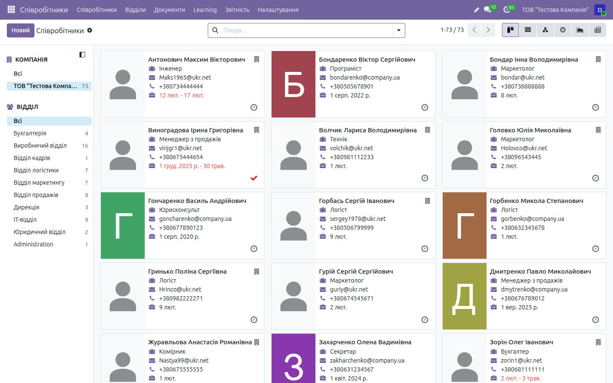
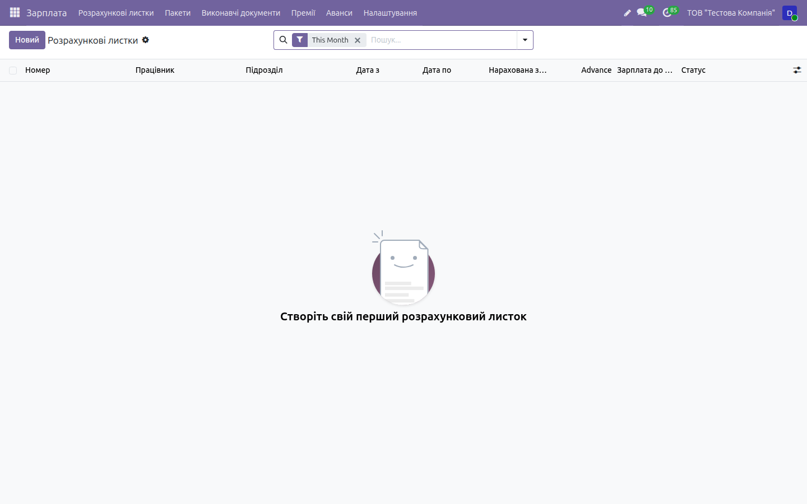
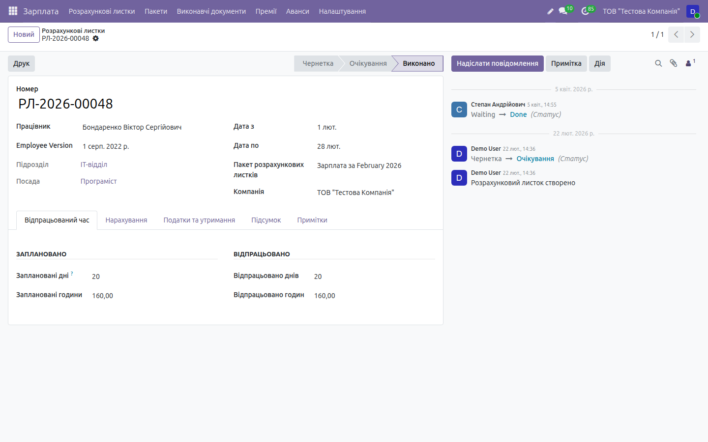
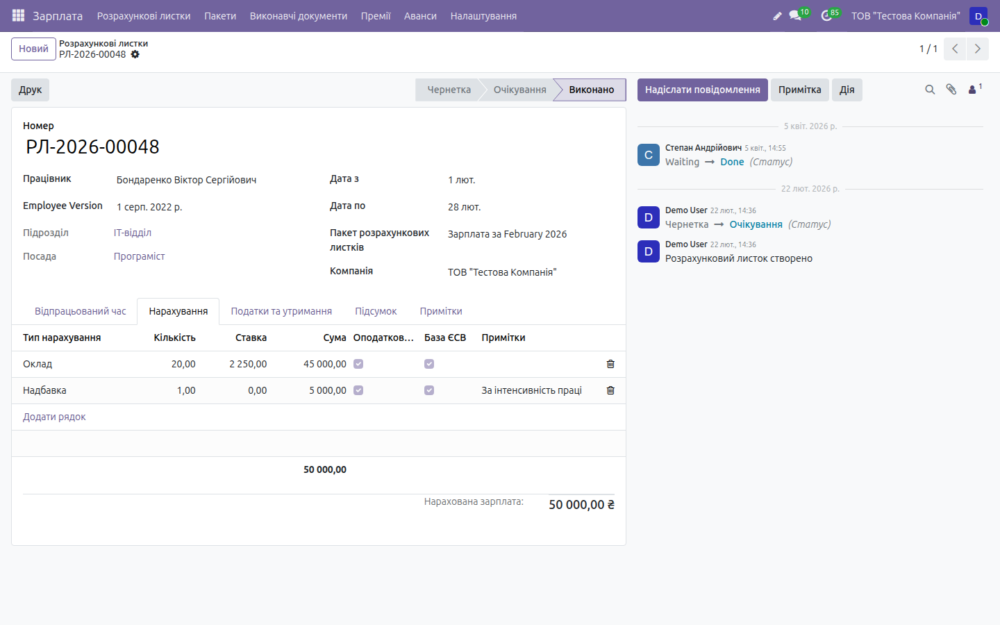
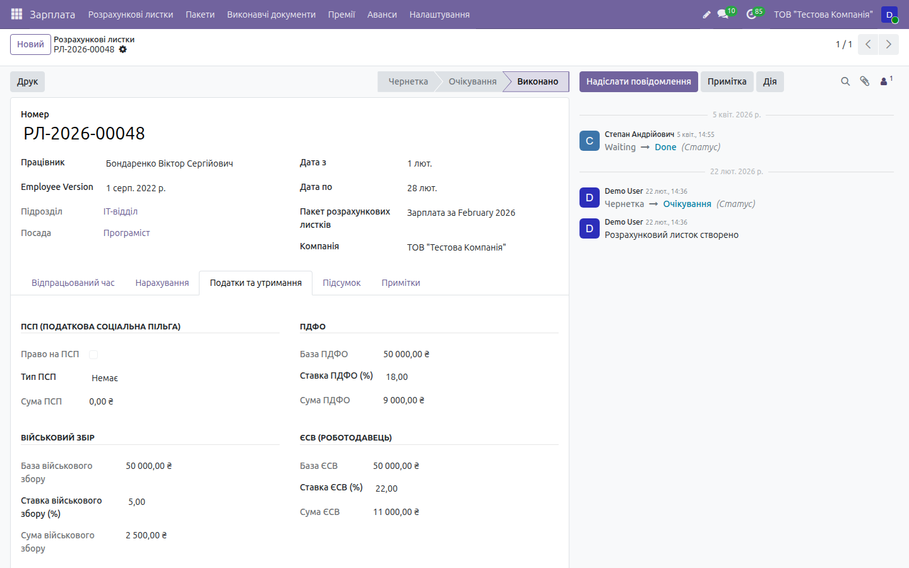

# HOWTO: HR та зарплата (заміна 1С:ЗУП) — робочі флоу

← [Назад до документації](../../README.md) · [Опис домену](../hr.md)

> Покрокові **робочі процеси** з реальним наповненням даних і результатами введення,
> виконані наживо на **[demo.ndev.online](https://demo.ndev.online)**
> (компанія _ТОВ «Тестова Компанія»_, вхід `demo`/`demo`). Кожен крок нижче реально
> пройдено — числа й розрахунки взято з фактично створеного розрахункового листка
> **РЛ-2026-00048** (Бондаренко В. С., IT-відділ, Програміст, лютий 2026).
> Дані на демо **не видаляються**, тож базу можна наповнювати під час тестування.
>
> Ролі та формули (зарплатник, кадровик, розрахунок податків) — див. `HR_UKRAINE.md`.

Скріншоти — у теці [`img/hr/`](img/hr/).

---

## Флоу 1. Розрахунок зарплати (повний цикл)

> Наскрізний процес «договір → листок → розрахунок → до виплати → друк». Виконано наживо,
> результат — листок **РЛ-2026-00048**, брутто **50 000,00 ₴**, до виплати **38 500,00 ₴**.

### Крок 1. Трудовий договір і оклад

Оклад для нарахування береться з версії договору працівника (`hr.version`, механізм
Odoo 19). У картці **Співробітники → Співробітники → Бондаренко В. С. → вкладка договору**:

| Поле | Значення |
|------|----------|
| Тип договору | Безстроковий |
| Режим роботи | Повний робочий день |
| **Оклад** (`wage`) | **45 000,00 ₴** |
| Надбавка (вкладка надбавок) | за інтенсивність праці — **5 000,00 ₴** |
| Графік роботи | 5-денний, 40 год/тиждень |

Оклад із договору автоматично підставляється в листок як нарахування типу **Оклад**,
а надбавка — окремим рядком.

### Крок 2. Створити розрахунковий листок

**Зарплата → Розрахункові листки → кнопка `Новий`.** Відкриється чорновий листок у стані
**Чернетка**. Заповніть:

| Поле | Значення |
|------|----------|
| Працівник | Бондаренко В. С. |
| Дата з | 01.02.2026 |
| Дата по | 28.02.2026 |
| Пакет | _(за потреби — для масового нарахування)_ |

Вкладка **Відпрацьований час**: заплановано **20 днів / 160 год**, відпрацьовано 20 / 160.
Для неповних місяців оплата рахується пропорційно відпрацьованим дням.

### Крок 3. Натиснути «Розрахувати»

Кнопка **`Розрахувати`** генерує нарахування (з договору + надбавки) та автоматично
обчислює податки й утримання за законодавством України. Статус — досі **Чернетка**.

### Крок 4. Результат: вкладка «Нарахування»

Вкладка **Нарахування** — брутто складається з рядків:

| Тип нарахування | Кількість | Ставка | Сума |
|-----------------|----------:|-------:|-----:|
| Оклад | 20 | 2 250,00 | 45 000,00 |
| Надбавка (за інтенсивність праці) | 1 | — | 5 000,00 |
| **Нарахована зарплата (брутто)** | | | **50 000,00 ₴** |

Кожен рядок має прапорці **Оподатковується** (входить у базу ПДФО/ВЗ) і **База ЄСВ**.

### Крок 5. Результат: вкладка «Податки та утримання»

Вкладка **Податки та утримання** — розрахунок від бази брутто 50 000 ₴:

| Показник | База | Ставка | Сума |
|----------|-----:|:------:|-----:|
| **ПДФО** | 50 000,00 | 18 % | **9 000,00 ₴** |
| **Військовий збір** | 50 000,00 | 5 % | **2 500,00 ₴** |
| **ЄСВ (роботодавець)** | 50 000,00 | 22 % | **11 000,00 ₴** |
| **ПСП** | — | немає | **0,00 ₴** |

- **ПДФО** та **ВЗ** утримуються із зарплати працівника;
- **ЄСВ** — нарахування роботодавця (не зменшує суму до виплати);
- **ПСП** застосовується автоматично, лише якщо місячний дохід ≤ ліміту; тут дохід 50 000 ₴
  перевищує ліміт → **ПСП = 0**.

### Крок 6. Результат: до виплати + статусний ланцюжок

Система одразу рахує підсумок:

| Показник | Сума |
|----------|-----:|
| Брутто (нараховано) | 50 000,00 ₴ |
| − ПДФО 18 % | −9 000,00 ₴ |
| − Військовий збір 5 % | −2 500,00 ₴ |
| **До виплати** | **38 500,00 ₴** |

Сума **38 500,00 ₴** відображається у списку листків у колонці «Зарплата до виплати» та на
вкладці **Підсумок**. Статусний ланцюжок (кнопки в шапці листка):
**Чернетка → Очікування → Виконано**. Історія переходів фіксується в чатері.

> _Скриншот:_ `08-payslip-summary.png` (вкладка «Підсумок»)

### Крок 7. Друк розрахункового листка

Кнопка **`Друк`** формує друковану форму розрахункового листка з нарахуваннями,
утриманнями й сумою до виплати.

> _Скриншот:_ `13-payslip-print.png`

---

## Флоу 2. Виконавчі документи (аліменти)

**Зарплата → Виконавчі документи → `Новий`.** Аліменти / виконавчі листи з утриманням із
зарплати. Виконано наживо, утримання рахується з проведених листків.

### Крок 1. Створити виконавчий документ

| Поле | Значення (приклад) |
|------|--------------------|
| Працівник | Бондаренко В. С. |
| Тип | Аліменти на неповнолітніх |
| **Метод** | % доходу / фіксована сума / % мінзарплати |
| Ставка | напр. 25 % доходу після податків |
| Черговість | 1 (аліменти на неповнолітніх) |
| Сума боргу (`total_amount`) | загальна сума до утримання |

### Крок 2. Результат: контроль межі та черговості

Під час розрахунку листка (Флоу 1) утримання формуються автоматично:

| Правило | Значення |
|---------|----------|
| Законна межа утримань | **50 %** доходу після податків |
| Межа за аліментами на неповнолітніх | **70 %** доходу після податків |
| Черговість (пріоритет) | 1 → 2 → 3 (нижчий пріоритет — лише залишок під лімітом) |
| Обмеження суми | ніколи не більше залишку боргу (`total_amount − collected_amount`) |
| Недоутримане | переноситься на наступний період (поступове погашення) |

`collected_amount` (фактично утримане) рахується лише з **проведених** листків
(`state = 'done'`), тож борг гаситься поступово в наступних періодах.

> _Скриншот:_ `09-execution-documents.png`

---

## Флоу 3. Прийом / звільнення (кадрові накази)

**Співробітники → Кадрові накази → `Новий`.** 8 типів наказів (прийняття, звільнення,
переведення, відпустка, премія, лікарняний, відрядження, інше), кожен із власною
нумерацією (`hr.order.<type>`).

### Крок 1. Наказ про прийняття

| Поле | Значення |
|------|----------|
| Тип наказу | Прийняття (форма П-1) |
| Працівник | новий співробітник |
| Дата | дата прийняття |
| Посада / оклад | з штатного розпису |

Результат: створюється / закривається версія договору (`hr.version`), присвоюється номер
наказу за типом.

### Крок 2. Наказ про звільнення (результат — компенсація відпустки)

| Поле | Значення |
|------|----------|
| Тип наказу | Звільнення (форма П-3) |
| Дата звільнення | проставляється в усіх версіях договору |
| Підстава | причина за КЗпП |

**Результат:** наказ автоматично **додає стандартну фразу про компенсацію за N календарних
днів невикористаної відпустки**. Кількість днів (`unused_vacation_days`) береться з
**балансу відпусток** (сума `remaining_days`); поле редаговане, фразу можна вимкнути
прапорцем `include_vacation_compensation`.

> _Скриншот:_ `04-hr-order-dismissal.png`

---

## Флоу 4. Відпустки/лікарняні, Табель П-5, Звітність 4ДФ

### Відпустки й лікарняні

**Відпустка → Заяви → `Новий`.** Щорічна основна (24 к.д.) / додаткова відпустка,
лікарняні (поля е-ТВН — заготовка інтеграції). Середня зарплата для відпускних рахується
за 12 місяців. **Лікарняні:** роботодавець оплачує перші 5 днів, з 6-го — ФСС; відсоток
залежить від страхового стажу. Залишки відпусток — **Відпустка → Звітність / залишки**;
саме звідси наказ на звільнення (Флоу 3) бере дні для компенсації.

> _Скриншот:_ `10-leave.png`

### Табель обліку робочого часу (П-5)

**Табель.** Формування табеля П-5 за місяць/підрозділ; відпрацьовані дні/години з табеля
підставляються в розрахунковий листок (Флоу 1, крок 2). Коди Я, В, Х, ВД; виробничий
календар з українськими святами, облік нічних і надурочних.

> _Скриншот:_ `11-timesheet-p5.png`

### Звітність 4ДФ

**Зарплата → Звітність** та **Співробітники → Звітність:** об'єднана звітність **4ДФ**
(ПДФО/ВЗ), **додаток Д5** (ЄСВ, XML-експорт), звіт про чисельність, ФОП. Дані беруться з
проведених листків. Детальніше — у [домені «Податки»](../taxes.md).

---

## Контрольний чек-лист флоу (звірено на демо)

- [x] **Договір:** оклад 45 000 ₴ + надбавка «за інтенсивність праці» 5 000 ₴ → підставлено в листок
- [x] **Листок РЛ-2026-00048:** відпрацьовано 20 днів / 160 год
- [x] **Нарахування:** Оклад 20 × 2 250 = 45 000 + Надбавка 5 000 = **50 000,00 ₴** брутто
- [x] **ПДФО** 50 000 × 18 % = **9 000 ₴**; **ВЗ** 50 000 × 5 % = **2 500 ₴**; **ЄСВ** 50 000 × 22 % = **11 000 ₴**
- [x] **ПСП = 0** (дохід 50 000 ₴ > ліміту)
- [x] **До виплати** = 50 000 − 9 000 − 2 500 = **38 500,00 ₴**
- [x] Статусний флоу **Чернетка → Очікування → Виконано**
- [x] Виконавчі документи: контроль межі **50 % / 70 %**, черговість 1→2→3, поступове погашення боргу
- [x] Наказ про звільнення додає фразу про компенсацію за N днів невикористаної відпустки (з балансу)
- [ ] Скриншоти `04`, `08`, `09`, `10`, `11`, `13` — догенерувати
