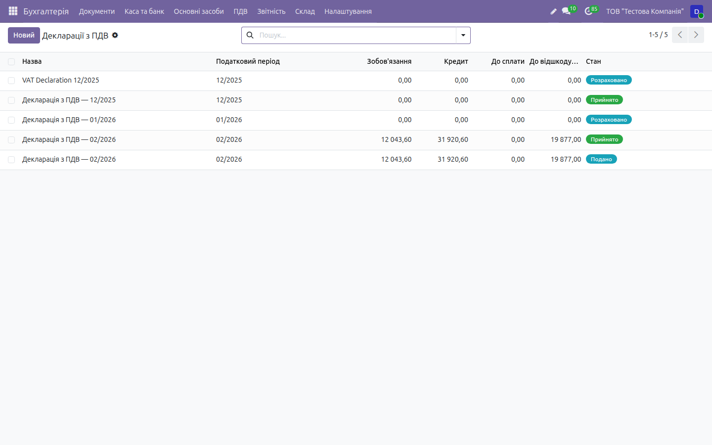

# HOWTO: Податки та звітність — робочі флоу

← [Назад до документації](../../README.md) · [Опис домену](../taxes.md)

> Покрокові **робочі процеси** з реальним наповненням даних і результатами введення,
> виконані наживо на **[demo.ndev.online](https://demo.ndev.online)**
> (компанія _ТОВ «Тестова Компанія»_, вхід `demo`/`demo`). Кожен крок нижче реально
> пройдено — числа взято з фактично створених документів демо-бази.
> Дані на демо **не видаляються**, тож базу можна наповнювати під час тестування.
>
> Застосунок: меню застосунків → **Податки**. Верхнє меню: **Податкові документи**,
> **Податкові періоди**, **ПДВ**, **Податковий кабінет**, **FOP (Simplified Tax)**,
> **Налаштування**.

Скріншоти — у теці [`img/taxes/`](img/taxes/).

## Базові ставки

Задаються в налаштуваннях компанії «Ukrainian Tax Settings» (модуль `l10n_ua_tax`):

| Податок | Ставка |
|---------|--------|
| ПДФО | 18 % |
| Військовий збір (ВЗ) | 5 % |
| ЄСВ | 22 % |
| ПДВ | 20 % / 7 % / 0 % |
| Єдиний податок ФОП (групи 1–4) | 2–5 % |

---

## Флоу 1. ПДВ: декларація з реєстрами виданих/отриманих ПН

> Наскрізний процес «податкові накладні → реєстри → декларація → баланс 6411».
> Виконано наживо, результат — декларація за період **02/2026**.

### Крок 1. Сформувати реєстри виданих і отриманих ПН

**Податки → ПДВ → Реєстри ПДВ.** Два реєстри:

| Реєстр | Джерело | Дія |
|--------|---------|-----|
| **Issued Register** (виданих ПН) | видані податкові накладні | `Розрахувати` (`action_compute`) автозаповнює рядки |
| **Received Register** (отриманих ПН) | отримані податкові накладні | `Розрахувати` автозаповнює рядки |

Реєстр підбирає всі ПН за обраний період, підсумовує бази й суми ПДВ, після перевірки
його **підтверджують** (є експорт XLSX). Реєстр виданих ПН формує **податкове зобов'язання**,
реєстр отриманих — **податковий кредит**.

> _Скриншот:_ `06-vat-registers.png`

### Крок 2. Сформувати декларацію з ПДВ за період

**Податки → ПДВ → Декларації з ПДВ → `Новий`.** Заповніть:

| Поле | Значення |
|------|----------|
| Період | **02/2026** |
| Компанія | ТОВ «Тестова Компанія» |

Натисніть **`Розрахувати`** (`action_calculate`) — система автоматично підбирає підтверджені
реєстри періоду й розносить суми по рядках декларації.

### Крок 3. Результат розрахунку (введені/обчислені суми)

Демо містить **5 декларацій з ПДВ**. Приклад **02/2026**:

| Показник | Сума |
|----------|-----:|
| Податкове зобов'язання (видані ПН) | 12 043,60 ₴ |
| Податковий кредит (отримані ПН) | 31 920,60 ₴ |
| **До відшкодування** (кредит − зобов'язання) | **19 877,00 ₴** |

Оскільки кредит перевищує зобов'язання, підсумок — **від'ємне значення до відшкодування**
(19 877,00 = 31 920,60 − 12 043,60).

### Крок 4. Провести декларацію по станах

Декларація проходить статуси через кнопки в шапці:

**Розраховано → Подано → Прийнято**

- **Розраховано** — суми пораховано з реєстрів (результат кроку 3);
- **Подано** — декларацію відправлено до ДПС (`action_mark_submitted`);
- **Прийнято** — ДПС підтвердила прийняття (`action_mark_accepted`).

Також доступні експорт XLSX і створення платежу за декларацією.

### Крок 5. Перевірити баланс рахунку 6411

Кнопка перегляду **сальдо рахунку ПДВ** відкриває обороти рахунку **6411 «Розрахунки за
податковими зобов'язаннями»**. Пошук службового рахунку **відфільтровано за компанією**
(`company_ids in company_id`) — у мультикомпанійній базі підтягується рахунок ПДВ лише
поточної компанії (issue #176).

> _Скриншот:_ `07-vat-6411-balance.png`

---

## Флоу 2. ФОП: єдиний податок і XML F0103309

> Наскрізний процес спрощенця: **книга доходів → декларація ЄП → розрахунок → XML для ДПС**.

**Податки → FOP (Simplified Tax).**

### Крок 1. Книга обліку доходів (автозаповнення з банку)

**FOP → Книга обліку доходів → `Новий`.** Книга ведеться **поквартально**; рядки доходу
підтягуються з банківської виписки:

| Поле | Значення |
|------|----------|
| Період | квартал звітного року |
| Рядки доходу | автозаповнення з банку (`bank_statement_line_id`) |

Кожен рядок прив'язаний до конкретного руху по банку. Після перевірки книгу **підтверджують**
(є друкована форма).

> _Скриншот:_ `08-fop-income-book.png`

### Крок 2. Декларація платника ЄП

**FOP → Декларація платника ЄП → `Новий`.** Заповніть:

| Поле | Значення |
|------|----------|
| Рік | звітний рік |
| Період | квартал / півріччя / 9 міс. / рік |
| Група ФОП | 1 / 2 / 3 (без ПДВ) / 3 (з ПДВ) |

Дохід підтягується з підтверджених книг доходів. Натисніть **`Розрахувати`**
(`action_calculate`) — система контролює **ліміт доходу групи** (`income_limit_exceeded`)
і рахує податки.

### Крок 3. Результат розрахунку (формули)

Для **групи 3 без ПДВ**:

| Показник | Формула | Ставка |
|----------|---------|-------:|
| Єдиний податок | дохід × 5 % | 5 % |
| Військовий збір ФОП | дохід × 1 % | 1 % |
| ЄСВ | мінзарплата × місяців × 22 % | 22 % |

ЄП і ВЗ рахуються від фактичного доходу з книги, ЄСВ — від мінзарплати за кількість місяців
періоду (незалежно від доходу).

### Крок 4. Згенерувати XML F0103309

Кнопка **`Згенерувати XML`** (`action_generate_xml`) формує **валідний XML форми F0103309**
(в. 9) для подання до ДПС:

- рендеринг делегується канонічному генератору
  `l10n_ua.tax.document.wizard._render_F0103309_xml` (єдина точка, без дублювання шаблону);
- заповнюються реквізити компанії, ДПІ, КВЕД, доходи, ЄП і ВЗ ФОП (1 % доходу);
- кодування — **windows-1251**;
- файл зберігається як вкладення декларації.

> Раніше кнопка була **заглушкою** — тепер формує реальний XML (issue #139).

> _Скриншот:_ `03-fop-declaration.png`

---

## Флоу 3. Об'єднана звітність 4ДФ (стисло)

Модуль `l10n_ua_tax_4df` — квартальний **Податковий розрахунок ПДФО/ВЗ/ЄСВ** (заміна 1ДФ + Д5
з 01.01.2021, форми J0501T01 для юрособи / F0501T01 для ФОП):

1. **Автозаповнення з зарплати** — `action_generate` агрегує дані з `hr.payslip`
   (`l10n_ua_hr_salary`): по кожній особі РНОКПП, ознака доходу, ПДФО/ВЗ, дати прийому/звільнення
   в кварталі (додаток 4ДФ) та ЄСВ (додаток 1);
2. **Поквартальне формування** підсумків і статуси;
3. **XML-експорт** (`action_generate_xml`) — базова структура (повна XSD-валідація — окреме
   завдання).

Доступ — застосунок **Співробітники → Звітність** або меню звітності зарплати.

> _Скриншот:_ `04-4df.png`

---

## Флоу 4. Податковий кабінет ДПС (стисло)

**Податки → Податковий кабінет** (`l10n_ua_tax_cabinet`) — єдина точка роботи з документами
для електронного кабінету cabinet.tax.gov.ua:

| Документ | Код |
|----------|-----|
| Декларація ЄП (ФОП) | **F0103309** (в. 9), F0103405 (в. 5) |
| Звіт з ЄСВ | **F0103308** |
| Декларація з ПДВ | **F0100210** |
| Податкова накладна | J1201010 |

Флоу: заповнення через **wizard** → генерація **XML (windows-1251)** → підпис КЕП
(`action_sign_document`) → подання (`action_submit_to_cabinet`) → перегляд XML/PDF і
довантаження підписаних файлів. Синхронізація звітних/вхідних/надісланих документів.

> _Скриншот:_ `05-tax-cabinet.png`

---

## Податкові періоди

**Податки → Податкові періоди** — довідник звітних періодів (місяць/квартал/рік) з обчисленням
меж дат, до яких прив'язуються декларації та закриття (`action_close` / `action_reopen`).

---

## Контрольний чек-лист флоу (звірено на демо)

- [x] **ПДВ:** декларація **02/2026** — зобов'язання 12 043,60 + кредит 31 920,60 → **до відшкодування 19 877,00 ₴**
- [x] Реєстри виданих/отриманих ПН автозаповнюються (`action_compute`) і підтверджуються
- [x] Стани декларації: **Розраховано → Подано → Прийнято**
- [x] Пошук службового рахунку ПДВ **6411** відфільтровано по компанії (issue #176)
- [x] **ФОП:** декларація формує **реальний XML F0103309** (не заглушка, issue #139)
- [x] Розрахунок ФОП гр.3: ЄП = дохід × 5 %, ВЗ = дохід × 1 %, ЄСВ = мінзарплата × міс × 22 %
- [x] **4ДФ** автозаповнюється з `hr.payslip`; **Кабінет ДПС** — F0103309/F0103308/F0100210
- [ ] Наповнити демо ФОП-книгою доходів для повного проходу (за потреби)
- [ ] Скріншоти догенерувати у `img/taxes/` (`03`–`08`)
