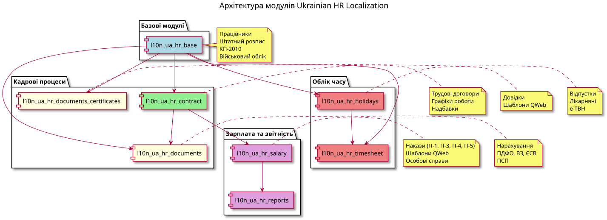
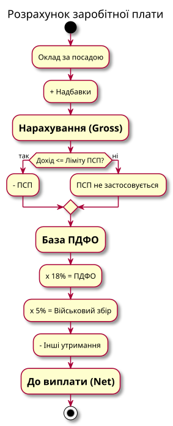

# HR та зарплата (заміна 1С:ЗУП)

← [Назад до головної](../README.md)



Повна заміна 1С:ЗУП: кадровий та військовий облік, трудові договори, кадрові накази, відпустки й лікарняні, розрахунок зарплати з податками, табель обліку робочого часу (П-5), бухгалтерські проводки та звітність ПФУ/ДПС.

Легенда статусів: ✅ Стабільний · 🟢 Робочий · 🟡 Бета · 📦 Збірка

## Ієрархія залежностей

```
hr (ядро Odoo)
 └── l10n_ua_hr_base ─────────────── кадровий + військовий облік, штатний розпис
      ├── l10n_ua_hr_contract ────── трудові договори (hr.version), надбавки, графіки
      │    └── l10n_ua_hr_salary ─── розрахунок зарплати, податки, виконавчі документи
      │         ├── l10n_ua_hr_salary_account ─ проводки зарплати (account)
      │         ├── l10n_ua_hr_salary_bonus ─── премії
      │         └── l10n_ua_hr_reports ──────── 4ДФ, Д5, чисельність, ФОП
      ├── l10n_ua_hr_documents ───── кадрові накази, особові справи
      │    ├── l10n_ua_hr_holidays ─ відпустки, лікарняні (е-ТВН)
      │    │    ├── l10n_ua_hr_attendance_sheet ─ табель П-5
      │    │    └── l10n_ua_hr_vacation_reserve ─ резерв відпусток (П(С)БО 26)
      │    └── l10n_ua_hr_employee_transfer ─── переведення в іншу організацію
      └── l10n_ua_hr_documents_certificates ── довідки
```

`l10n_ua_hr` — метапакет, що встановлює весь стек одразу.

## Модулі

| Модуль | Версія | Статус | Призначення |
|--------|--------|--------|-------------|
| `l10n_ua_hr` | 19.0.1.0.0 | 📦 | Збірка повного HR-стеку (8 модулів) |
| `l10n_ua_hr_base` | 19.0.1.0.5 | ✅ | Кадровий та військовий облік, штатний розпис |
| `l10n_ua_hr_contract` | 19.0.2.0.0 | ✅ | Трудові договори (hr.version), надбавки, графіки |
| `l10n_ua_hr_salary` | 19.0.1.1.0 | ✅ | Розрахунок зарплати, податки, виконавчі документи |
| `l10n_ua_hr_salary_account` | 19.0.1.0.0 | 🟢 | Бухгалтерські проводки зарплати |
| `l10n_ua_hr_salary_bonus` | 19.0.1.0.0 | 🟢 | Премії |
| `l10n_ua_hr_documents` | 19.0.1.0.1 | ✅ | Кадрові накази, шаблони, особові справи |
| `l10n_ua_hr_documents_certificates` | 19.0.1.1.0 | 🟢 | Довідки |
| `l10n_ua_hr_holidays` | 19.0.1.0.3 | ✅ | Відпустки та лікарняні (е-ТВН) |
| `l10n_ua_hr_attendance_sheet` | 19.0.1.0.0 | ✅ | Табель обліку робочого часу (П-5) |
| `l10n_ua_hr_reports` | 19.0.1.0.0 | ✅ | Звітність ПФУ/ДПС (4ДФ, Д5) |
| `l10n_ua_hr_employee_transfer` | 19.0.1.0.0 | 🟢 | Переведення в іншу організацію |
| `l10n_ua_hr_vacation_reserve` | 19.0.1.0.0 | 🟢 | Резерв відпусток (П(С)БО 26) |

---

## База

### l10n_ua_hr_base — Кадровий облік

Фундамент усього стеку. Розширює `hr.employee` та довідники.

| Модель | Опис |
|--------|------|
| `hr.employee` | РНОКПП/ІПН, паспорт/ID-картка, військовий облік, пільги, родина, адреси реєстрації та фактична |
| `hr.employee.child` | Діти співробітника (для ПСП та відпусток) |
| `hr.kp2010` | Класифікатор професій ДК 003:2010 (~9000 записів) |
| `hr.staffing.table` | Штатний розпис (одиниці 0.5/1.0, вакансії, фонд оплати) |
| `hr.military.rank`, `hr.military.tcc` | Військові звання, ТЦК |
| `hr.education.level`, `hr.tariff.grade`, `hr.employee.benefit` | Освіта, тарифні розряди, пільги з множниками ПСП |

Звіти: особова картка П-2, списки співробітників, військовий облік, вакансії. Демо-дані та довідники завантажуються при встановленні.

---

## Контракти

### l10n_ua_hr_contract — Трудові договори

Використовує рідну модель Odoo 19 `hr.version` (замість окремого `hr.contract`).

| Тип договору | Опис |
|--------------|------|
| permanent | Безстроковий |
| fixed_term | Строковий |
| civil | Цивільно-правовий |
| gig_contract | Гіг-контракт (Дія.City, ПДФО 5%, без ЄСВ) |

Додатково: режими роботи (повний/неповний/гнучкий/дистанційний), графіки (5-денка, змінний, гнучкий), надбавки `hr.version.allowance` (за стаж, шкідливість, інтенсивність, нічні), випробувальний термін, сумісництво (`hr.job.combining`), зміни окладу (`hr.version.salary.change`), причини звільнення за КЗпП.

---

## Зарплата й податки

### l10n_ua_hr_salary — Розрахунок зарплати



Основна модель `hr.payslip` з нарахуваннями (`hr.payslip.accrual`) та утриманнями (`hr.payslip.deduction`).

**Формули податків:**

| Показник | Формула |
|----------|---------|
| ПДФО | (Gross − ПСП) × 18% |
| Військовий збір | Gross × 5% |
| ЄСВ | min(max(Gross, МЗП), 15×МЗП) × 22% |
| ПСП | 50% / 150% / 200% прожиткового мінімуму (з перевіркою межі доходу) |

Пріоритет типу ПСП: 200% > 150% > стандартна > немає (ст. 169 ПКУ). Параметри року (МЗП, прожитковий мінімум, ставки) — у `hr.psp.parameters`.

**Нарахування зарплати** (`_generate_accruals`): за тарифним розрядом (погодинно) або окладом (по відпрацьованих днях). Автозгенеровані нарахування перестворюються, ручні (премії) зберігаються. Якщо базову зарплату введено вручну — версійне нарахування **не додається понад неї** (усунено подвійний облік).

**Виконавчі документи** (`hr.execution.document` — аліменти, рішення суду, податковий/інший борг):
- Утримання (`_generate_deductions`) обробляються **в законному порядку черговості** (1 — аліменти на неповнолітніх, 2 — інші аліменти, 3 — інші борги).
- Дотримано **законну межу утримання 50% (або 70% для аліментів) від доходу після податків**; документи нижчої черговості отримують лише залишок під межею.
- Утримання ніколи не перевищує залишок боргу (`total_amount − collected_amount`); недоутримане переноситься на наступний період (поступове погашення боргу).
- `collected_amount` обчислюється з утримань лише **проведених** розрахункових листів (`state = 'done'`).

Також: аванс (`hr.salary.advance` + пакетне нарахування `hr.salary.advance.run`), пакетний розрахунок `hr.payslip.run`, друк розрахункового листа, банківські відомості. Реальні тести на розрахунок, ПСП, аванс і межу виконавчих документів (у т.ч. мультикомпанійні).

**Додаткові механізми оплати праці:**
- **Авто-доплати з табеля** — нічні (% годинної ставки, ст. 108 КЗпП), понаднормові (×2, ст. 106), святкові (×2, ст. 107); множники в `hr.psp.parameters`.
- **Індексація ЗП** — реєстр індексів споживчих цін (`hr.cpi.index`), накопичення наростаючим підсумком з порогом 101% (Порядок №1078); авто-рядок «Індексація» на дохід у межах ПМ.
- **Дохід у натуральній формі** — вид `INKIND` з gross-up бази ПДФО/ВЗ за натуральним коефіцієнтом К = 100/(100 − ставка ПДФО) (п. 164.5 ПКУ).
- **Ретро-перерахунки** — перерахунок закритого періоду recompute-and-diff, перенесення дельти окремим рядком у поточний листок (аудит `hr.payslip.retro`, ідемпотентно).
- **Депонування** — облік невиплаченої ЗП (`hr.salary.deposit` + виплати), залишок по працівниках.
- **Зарплатний файл у клієнт-банк** — майстер `hr.payslip.bank.export`: формати XML/DBF та клієнт-банків **iFOBS** (Укргазбанк) і **iBank 2 UA** (VST Bank) за розширюваним реєстром; окремий експорт даних працівників для відкриття карток (iFOBS).

Реальні тести на доплати, індексацію, натуроплату, ретро, депонування та банк-файли.

### l10n_ua_hr_salary_account — Проводки зарплати 🟢

Автоматичне створення бухгалтерських проводок при нарахуванні зарплати. Конфігурація рахунків (`hr.salary.account.config`), налаштування по підрозділах. Залежить від `account`.

### l10n_ua_hr_salary_bonus — Премії 🟢

Типи премій з податковими налаштуваннями (ПДФО/ВЗ/ЄСВ), записи премій із workflow Draft → Confirmed → Paid, автоматичне включення підтверджених премій у розрахунок. Тест на мультикомпанійність.

---

## Документи

### l10n_ua_hr_documents — Кадрові накази

| Тип наказу | Форма |
|------------|-------|
| Прийом | П-1 |
| Переведення | П-5 |
| Звільнення | П-3 |
| Відпустка | П-4 |
| Премія, відрядження, лікарняний, інше | — |

Шаблони наказів (`hr.order.template`) з плейсхолдерами, автоматична нумерація по типах, особові справи (`hr.personal.file`), особова картка П-2.

**Наказ про звільнення** тепер містить фразу про **компенсацію за невикористану відпустку** з автоматично обчисленою кількістю календарних днів (`unused_vacation_days` — сума `remaining_days` з балансу відпусток; поле редаговане, перемикач `include_vacation_compensation`). Реальні тести на накази, звільнення та компенсацію відпустки.

### l10n_ua_hr_documents_certificates — Довідки 🟢

Довідки: про роботу, про зарплату, про стаж, про доходи, характеристика, для банку, про відпустку. Типи з шаблонами, автозаповнення з картки співробітника, реєстр із нумерацією, workflow draft → approved → issued.

### l10n_ua_hr_employee_transfer — Переведення в іншу організацію 🟢

Майстер переведення співробітника між компаніями групи за КЗпП ст. 36 п. 5: створює новий `hr.employee` у цільовій компанії з копіюванням персональних даних, формує накази у джерельній та цільовій компаніях, деактивує старий запис, зв'язує через `previous_employee_id`/`next_employee_id`. Режими балансу відпусток: reset (за замовчуванням) / transfer.

---

## Відпустки та лікарняні

### l10n_ua_hr_holidays — Відпустки та лікарняні

Розширює `hr_holidays`.

| Тип | Опис |
|-----|------|
| Щорічна основна | 24 календарних дні |
| Додаткова | За шкідливі умови, за дітей |
| Навчальна | Для здобуття освіти |
| Без збереження | За власний рахунок |
| Лікарняний | `hr.sick.leave` |

Баланс відпусток по співробітниках (`hr.vacation.balance`), графік відпусток (`hr.vacation.schedule`), середня зарплата для розрахунку відпускних, компенсація при звільненні.

**Лікарняні:** оплата роботодавцем (перші 5 днів) + ФСС (з 6-го дня), відсоток за страховим стажем. Поля е-ТВН (`is_electronic`, `etvn_id`) присутні як **заготовка** — реальної інтеграції з API ПФУ ще немає.

---

## Табель

### l10n_ua_hr_attendance_sheet — Табель обліку робочого часу

Місячний табель П-5: стандартні коди (Я, В, Х, ВД тощо), автоматичне заповнення з інтеграцією відпусток і лікарняних, виробничий календар з українськими святами, облік нічних і надурочних годин, звіт форми П-5.

### l10n_ua_hr_vacation_reserve — Резерв відпусток 🟢

Щомісячне нарахування резерву відпусток за П(С)БО 26 та ст. 23.4 ПКУ через cron: Дт 23/91/92/93 — Кт 471; сторно при виплаті: Дт 471 — Кт 661. Налаштування рахунків витрат по посадах/співробітниках. Залежить від `account`.

---

## Звіти

### l10n_ua_hr_reports — Звітність ПФУ/ДПС

| Звіт | Опис |
|------|------|
| 4ДФ / 1ДФ | Податковий звіт (місячний/квартальний) |
| Д5 | Місячний звіт ЄСВ (з XML-експортом) |
| Чисельність | Середньооблікова чисельність |
| ФОП | Звіт по фонду оплати праці |

Реальні тести на 4ДФ, Д5 та чисельність.

> Об'єднаний звіт 4ДФ також доступний у модулі [`l10n_ua_tax_4df`](taxes.md).

---

## Встановлення

```bash
# Увесь HR-стек однією командою (метапакет)
odoo-bin -d mydb -i l10n_ua_hr --stop-after-init
```
