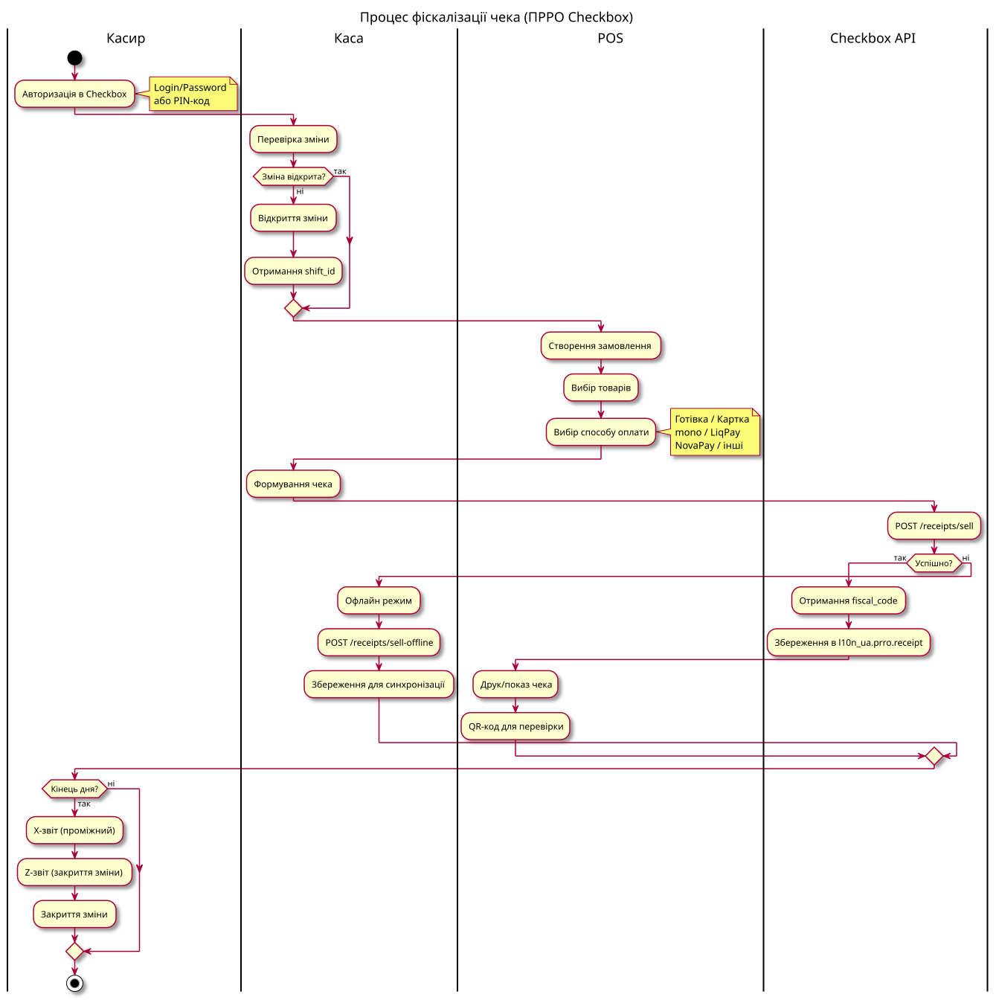

# ПРРО (програмні РРО)

← [Назад до головної](../README.md)

Легенда статусів: ✅ Стабільний · 🟢 Робочий · 🟡 Бета · 📦 Збірка

Домен реалізує фіскалізацію продажів через програмні РРО (ПРРО) для України:
базові моделі чеків/змін та інтеграцію з хмарним сервісом Checkbox.

| Модуль | Версія | Статус | Призначення |
|--------|--------|--------|-------------|
| `l10n_ua_prro_base` | 19.0.1.0.0 | 🟢 | Базові моделі ПРРО: конфігурація, чек, зміна, абстрактний mixin |
| `l10n_ua_prro_checkbox` | 19.0.1.0.0 | 🟢 | Інтеграція з Checkbox API (реєстрація чеків, зміни, Z/X-звіти) |

---

## l10n_ua_prro_base — Базовий модуль

**Версія:** 19.0.1.0.0 · **Ліцензія:** LGPL-3
**Залежності:** `l10n_ua_account_base`, `point_of_sale`

Надає постачальник-незалежний фундамент для ПРРО-інтеграцій. Сам чеки не
фіскалізує — методи виконання винесені в абстрактний mixin, який реалізують
конкретні провайдери (наприклад, Checkbox).

### Моделі

| Модель | Тип | Опис |
|--------|-----|------|
| `l10n_ua.prro.mixin` | AbstractModel | Абстрактний інтерфейс провайдера ПРРО |
| `l10n_ua.prro.config` | Model | Налаштування ПРРО (успадковує mixin) |
| `l10n_ua.prro.receipt` | Model | Фіскальний чек |
| `l10n_ua.prro.receipt.line` | Model | Рядок чека |
| `l10n_ua.prro.shift` | Model | Зміна (X/Z-звіти) |

**`l10n_ua.prro.mixin`** — абстрактні методи, які кидають `NotImplementedError`
і мають бути перевизначені у провайдері:
`action_open_shift`, `action_close_shift`, `action_x_report`,
`action_register_receipt`, `action_service_input`, `action_service_output`.
Містить поле `prro_provider` (Selection, розширюване через `selection_add`).

**`l10n_ua.prro.config`** — конфігурація ПРРО: назва, фіскальний номер,
провайдер (`checkbox` / `vchasno` / `other`), компанія, зв'язок із
`pos.config` (Many2many). Стан: `not_configured` → `configured` → `active` /
`error`. Обчислюване поле `current_shift_id` знаходить відкриту зміну.

**`l10n_ua.prro.receipt`** — фіскальний чек. Типи: продаж (`sale`),
повернення (`return`), службове внесення (`service_input`), службова видача
(`service_output`). Оплата: готівка / картка / змішана; сума обчислюється як
`cash_amount + card_amount`. Зв'язок із `pos.order`, поле `qr_code`,
стан `draft` → `registered` / `error`. Рядок чека містить `uktzed_code`
(код УКТЗЕД), кількість, ціну, знижку, ставку податку та обчислюваний
`subtotal`.

**`l10n_ua.prro.shift`** — зміна каси. Обчислювані підсумки: кількість чеків,
загальні продажі/повернення, готівка/картка, службові внесення/видача.
Стан `open` → `closed`, номер Z-звіту. Метод `action_close` закриває зміну.

### Дані та довідники

- `data/pos_payment_method_data.xml` — методи оплати POS.

> **Примітка щодо статусу.** Модуль надає повноцінні моделі та подання, але
> логіка виконання (`action_*`) — це абстрактні заглушки в mixin. Тестів немає.
> Тому статус 🟢, а не ✅.

---

## l10n_ua_prro_checkbox — Інтеграція з Checkbox

**Версія:** 19.0.1.0.0 · **Ліцензія:** LGPL-3
**Залежності:** `l10n_ua_prro_base`

Реалізація провайдера ПРРО на базі хмарного сервісу
[Checkbox](https://checkbox.in.ua) (`https://api.checkbox.in.ua/api/v1/`).

### Моделі

| Модель | Опис |
|--------|------|
| `l10n_ua.prro.checkbox.config` | Конфігурація підключення до Checkbox (успадковує `mail.thread`) |

Клас `CheckboxAPI` (`models/checkbox_api.py`) — HTTP-клієнт на `requests`
з обробкою помилок, тайм-аутом (30 с) та розбором дати
(`parse_checkbox_datetime`).

### Автентифікація

Два типи (`auth_type`):
- **Логін і пароль** — `POST /cashier/signin`;
- **PIN-код** — `POST /cashier/signinPinCode` (з ліцензійним ключем).

Токен доступу зберігається (`access_token`) з терміном дії 1 тиждень.
Стан конфігурації: `draft` → `configured` → `authenticated` / `error`.
Поля авторизації очищуються при зміні `auth_type` (`_clean_auth_fields`).

### Дії (методи моделі)

| Метод | API-виклик | Опис |
|-------|-----------|------|
| `action_authenticate` | `signin` + `cashier/me` + `cash-registers/info` | Вхід касира, підтягування даних каси |
| `action_signout` | `cashier/signout` | Вихід |
| `action_test_connection` | `cash-registers/ping-tax-service` | Перевірка зв'язку з ДПС |
| `action_open_shift` | `POST /shifts` | Відкриття зміни + запис `l10n_ua.prro.shift` |
| `action_close_shift` | `POST /shifts/close` | Закриття зміни (Z-звіт) |
| `action_x_report` | `POST /reports` | X-звіт |
| `action_register_receipt` | `POST /receipts/sell` | Реєстрація чека продажу |
| `action_service_input` | `POST /receipts/service` | Службове внесення готівки |
| `action_service_output` | `POST /receipts/service` (від'ємна сума) | Службова видача готівки |
| `action_sync_taxes` | `GET /tax` | Синхронізація ставок податків |

### Можливості `CheckboxAPI`

| Група | Ендпоінти |
|-------|-----------|
| Каса | `info`, `go-online`, `go-offline`, `ping-tax-service` |
| Зміни | `get_shift`, `open_shift`, `close_shift`, `get_shift_info` |
| Чеки | `sell`, `sell-offline`, `return`, `service`, `search`, `get` |
| Формати чека | text, html, png, qrcode |
| Звіти | X-звіт (`create_x_report`), `get_report`, `get_report_text` |
| Офлайн | `ask_offline_codes`, `get_offline_codes`, `get_offline_time` |
| Податки | `get_taxes` |

> **Примітка щодо статусу.** Клієнт Checkbox повністю реалізований (офлайн-режим,
> повернення, усі формати чека доступні в `CheckboxAPI`), але частина методів
> (`sell-offline`, `return`, друковані формати) ще не задіяна з боку моделі,
> а автоматичних тестів немає. Тому статус 🟢.

### Обмеження та плани

- Реєстрація чека створює запис `l10n_ua.prro.receipt`, але лінії чека з
  `pos.order` поки не переносяться автоматично.
- Тайм-аут запиту (30 с) захардкоджений — позначено `TODO` для винесення в
  налаштування.
- Провайдер `vchasno` (Vchasno Kasa) оголошений у Selection, але окремого
  модуля-інтеграції ще немає.
