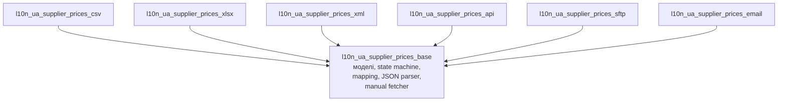
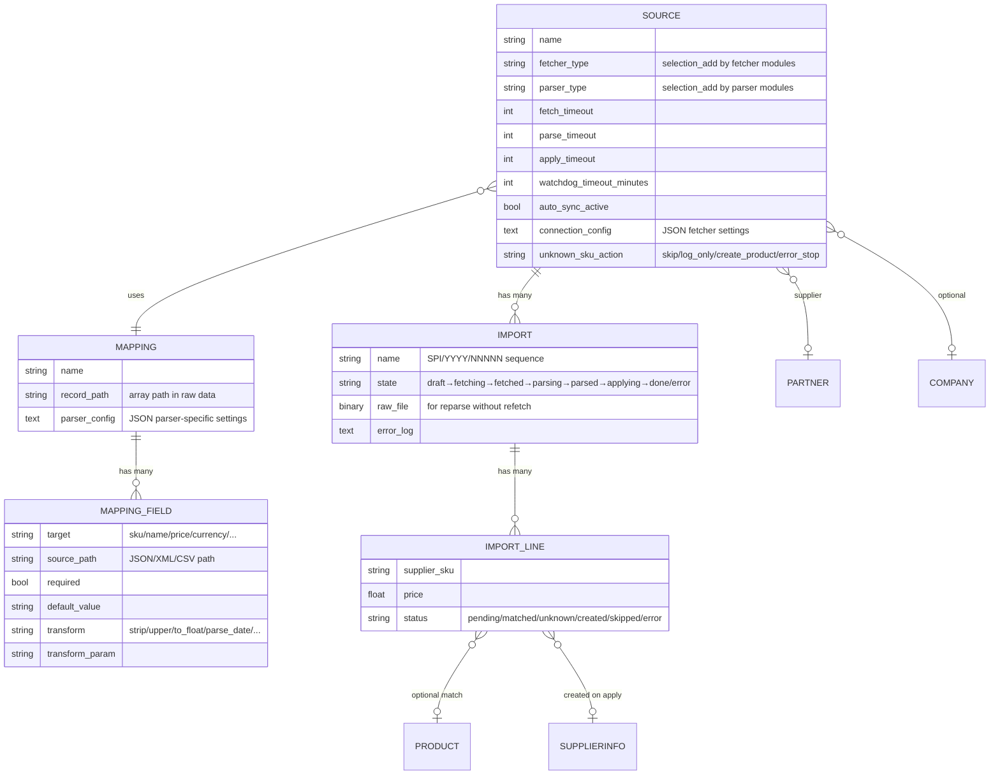
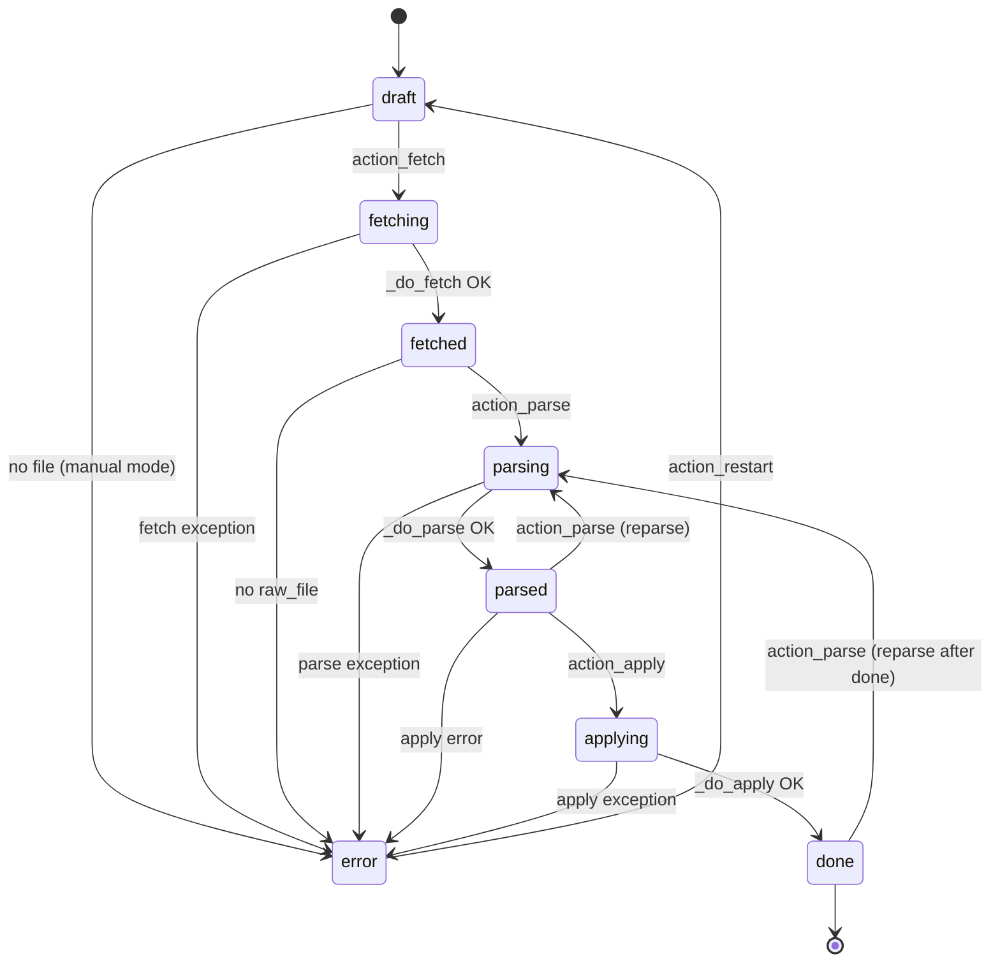
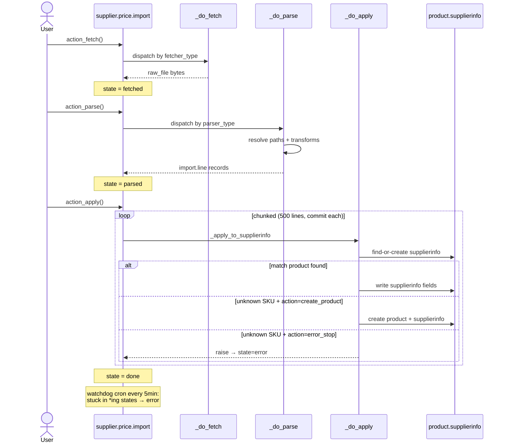

# Supplier Prices — архітектура

Документ описує архітектуру модулів `l10n_ua_supplier_prices_*`:
імпорт прайс-листів постачальників у `product.supplierinfo` з підтримкою
різних джерел доступу (API/SFTP/email/manual upload) та форматів
(JSON/XML/CSV/XLSX).

**Цільова платформа:** Odoo 19 CE.

---

## 1. Огляд модулів

Функціональність розділена на базовий модуль + незалежні parser/fetcher розширення.



**Статус:**
- `base` — реалізовано (JSON parser, manual fetcher)
- `csv` — реалізовано
- Інші — заплановані (шаблон той самий)

Усі розширення залежать **тільки** від `base`. Parsers між собою незалежні.
Fetchers між собою незалежні. Parser і fetcher комбінуються довільно на
рівні `supplier.price.source` (SFTP+XLSX, Email+CSV, тощо).

---

## 2. Моделі даних



**Ключові дизайн-рішення:**

- **`raw_file` зберігається в `ir.attachment`** після fetch — дозволяє
  перепарсити без повторного звернення до зовнішньої системи (fix mapping
  → reparse, швидко).
- **`company_id` nullable** на source — порожнє значення = ціни глобальні
  (видимі всім компаніям). Корисно коли один постачальник однаково працює
  з усіма компаніями групи.
- **`currency_id` nullable** на line — може відрізнятись по-рядково
  (прайс з цінами в UAH/USD/EUR одночасно). При apply конвертується по
  курсу НБУ (через `product.supplierinfo.currency_id`).
- **`status` на line** ведеться для audit — бачимо чому рядок skipped
  або який product створено.

---

## 3. State Machine



**Правила переходів** — `STATE_TRANSITIONS` в
`l10n_ua_supplier_price_import.py`. Зміна state — **тільки** через
`_set_state(new_state)` який валідує перехід. Прямий `write({'state': ...})`
призведе до невалідного стану — не використовувати.

**Важливо: action-методи НЕ raise UserError на помилках** —
замість цього встановлюють `state='error'` + `error_log` і викликають
`message_post`. Причина: `raise` у action методі викликає rollback
транзакції Odoo, через що state='error' втрачається. Зараз state
зберігається, користувач бачить статус через statusbar + chatter.

---

## 4. Pipeline виконання



**Chunked apply:** рядки обробляються батчами по 500, `env.cr.commit()`
після кожного чанку. Це:
1. Звільняє row locks на `product.supplierinfo` — інші процеси не чекають.
2. Оновлює `write_date` — watchdog бачить активність, не зарахує як stuck.
3. Обмежує memory footprint — великі прайси (50k+ рядків) не ламають воркера.

**Timeout деградація** — якщо `apply_timeout` вичерпано посеред імпорту:
raise UserError → state=error. Рядки, оброблені до timeout, вже
закомічені — повторний `action_apply` продовжить з останньої точки
(фактично реран безпечний через find-or-create на supplierinfo).

---

## 5. Mapping конфігурація

Mapping описує, як з raw-файлу витягти структуровані поля.

### Поля рівня mapping

| Поле | Приклад | Призначення |
|------|---------|-------------|
| `record_path` | `items`, `data.products`, `//product` | Шлях до масиву записів |
| `parser_config` | `{"delimiter": ";"}` | Parser-specific JSON |
| `field_ids` | — | Список полів (нижче) |

### Поля рівня mapping field

| Поле | Приклад | Призначення |
|------|---------|-------------|
| `target` | `sku`, `price`, `currency` | Куди записуємо значення |
| `source_path` | `items[0].price.value` | Шлях до значення у record |
| `required` | `true` | Помилка якщо відсутнє |
| `default_value` | `UAH` | Використовується якщо відсутнє і не required |
| `transform` | `to_float` | Перетворення значення |
| `transform_param` | `%d/%m/%Y` | Параметр трансформації |

### Path синтаксис

| Parser | Синтаксис | Приклад |
|--------|-----------|---------|
| JSON | dotted + `[n]` + `[*]` | `items[*].price.value` |
| CSV (has_header) | назва колонки | `Ціна` |
| CSV (no header) | індекс як число | `2` |
| XML (запланований) | XPath | `//product/@code` |
| XLSX (запланований) | назва колонки або "A1" | `Price` |

### Трансформації (`tools/transforms.py`)

`none`, `strip`, `upper`, `lower`, `replace_comma`, `to_float`,
`to_decimal`, `parse_date` (+ формат у `transform_param`), `multiply`
(+ factor у `transform_param`).

Українська специфіка:
- `replace_comma` або `to_float` для цін з комою: `"15,50"` → `15.50`
- `parse_date` з форматом `%d.%m.%Y` для `"17.04.2026"`

---

## 6. Timeout стратегія

Чотири рівні timeout на кожному `supplier.price.source`:

| Поле | Default | Призначення |
|------|---------|-------------|
| `fetch_timeout` (сек) | 60 | connect + read для API/SFTP/email |
| `parse_timeout` (сек) | 300 | loop по records з deadline check |
| `apply_timeout` (сек) | 600 | loop по chunks з deadline check |
| `watchdog_timeout_minutes` | 30 | cron переводить stuck → error |

**Де використовуються:**
- Fetchers викликають мережеві API/SFTP з `timeout=source.fetch_timeout`
- Parser перевіряє `datetime.now() > deadline` кожен record
- Apply перевіряє deadline кожен chunk + commit після чанку
- Watchdog cron (кожні 5 хв) — `_cron_watchdog()` переводить imports у
  станах `fetching/parsing/applying` у `error` якщо `write_date` старіший
  ніж `watchdog_timeout_minutes`

**Мета:** імпорт не може блокувати worker надовго. Зовнішній API що
висить — max 60 сек. Великий файл — обмежений розміром + commits
звільняють locks.

---

## 7. Як додати новий parser

Приклад: додати XLSX parser.

### 7.1. Створити модуль

```
l10n_ua_supplier_prices_xlsx/
├── __init__.py
├── __manifest__.py
├── models/
│   ├── __init__.py
│   ├── l10n_ua_supplier_price_source.py   # selection_add
│   └── l10n_ua_supplier_price_import.py   # override _do_parse
└── tests/
    └── test_xlsx_parser.py
```

### 7.2. Розширити `parser_type`

```python
# models/l10n_ua_supplier_price_source.py
from odoo import fields, models

class L10nUaSupplierPriceSource(models.Model):
    _inherit = 'l10n_ua.supplier.price.source'

    parser_type = fields.Selection(
        selection_add=[('xlsx', 'Excel XLSX')],
        ondelete={'xlsx': 'set default'},  # ОБОВ'ЯЗКОВО для required Selection
    )
```

### 7.3. Додати парсер через override

```python
# models/l10n_ua_supplier_price_import.py
from odoo import models
from odoo.addons.l10n_ua_supplier_prices_base.tools.transforms import (
    apply_transform, TransformError,
)

class L10nUaSupplierPriceImport(models.Model):
    _inherit = 'l10n_ua.supplier.price.import'

    def _do_parse(self):
        self.ensure_one()
        if self.source_id.parser_type == 'xlsx':
            return self._parse_xlsx()
        return super()._do_parse()

    def _parse_xlsx(self):
        config = self._get_parser_config()
        sheet_name = config.get('sheet_name')
        # ... openpyxl logic ...
        # Для кожного рядка — викликати self._assign_field_value(...)
```

### 7.4. Залежність від зовнішньої бібліотеки

```python
# __manifest__.py
'external_dependencies': {'python': ['openpyxl']},
```

### 7.5. Використати спільні хелпери base

- `self._get_parser_config()` — JSON settings
- `self._assign_field_value(vals, target, value, currency_cache, Currency)` —
  розкладає значення по правильних полях `import.line`
- `apply_transform(value, transform, param)` — трансформації
- `self.source_id.parse_timeout` — deadline check

---

## 8. Як додати новий fetcher

Аналогічно parser, але override `_do_fetch` і розширюємо `fetcher_type`.

### 8.1. Розширити selection

```python
class L10nUaSupplierPriceSource(models.Model):
    _inherit = 'l10n_ua.supplier.price.source'

    fetcher_type = fields.Selection(
        selection_add=[('sftp', 'SFTP')],
        ondelete={'sftp': 'set default'},
    )
```

### 8.2. Реалізувати `_do_fetch`

```python
class L10nUaSupplierPriceImport(models.Model):
    _inherit = 'l10n_ua.supplier.price.import'

    def _do_fetch(self):
        self.ensure_one()
        if self.source_id.fetcher_type == 'sftp':
            return self._fetch_sftp()
        return super()._do_fetch()

    def _fetch_sftp(self):
        config = json.loads(self.source_id.connection_config or '{}')
        host = config['host']
        # paramiko з timeout=self.source_id.fetch_timeout
        # Результат — встановити self.raw_file = base64(downloaded_bytes)
        # і self.raw_filename = "..."
```

### 8.3. Хендшейк з base

`_do_fetch` **мусить** виставити `self.raw_file` (base64) і
`self.raw_filename`. Далі `action_fetch` сам перейде в state `fetched`.

### 8.4. Структура `connection_config`

`connection_config` — JSON Text поле на source. Кожен fetcher визначає
свою схему:

```python
# SFTP
{"host": "sftp.example.com", "port": 22, "username": "...",
 "password": "...", "remote_path": "/prices/latest.xlsx"}

# API
{"url": "https://...", "auth_type": "bearer", "api_key": "...",
 "json_path_to_file": "data.download_url"}
```

⚠️ **Безпека:** наразі credentials зберігаються у plain text. В майбутньому
— шифрувати через `ir.config_parameter` або окрему модель зашифрованих
секретів. Це TODO на перший production-ready реліз.

---

## 9. Приклади використання

### 9.1. JSON прайс від API

Файл:
```json
{"items": [
  {"code": "A-001", "title": "Гайка М8", "price": {"value": "15.50", "currency": "UAH"}},
  {"code": "A-002", "title": "Болт М10", "price": {"value": "22.00", "currency": "UAH"}}
]}
```

Mapping:
- `record_path` = `items`
- Fields:
  - `sku` ← `code` (required)
  - `name` ← `title`
  - `price` ← `price.value` (required, transform `to_float`)
  - `currency` ← `price.currency`

### 9.2. CSV з windows-1251 і комою-десятковим роздільником

Файл (windows-1251, перший рядок — header, розділювач `;`):
```
Артикул;Назва;Ціна
А-001;Гайка М8;15,50
А-002;Болт М10;22,00
```

Mapping:
- `parser_config` = `{"delimiter": ";", "encoding": "windows-1251", "has_header": true}`
- Fields:
  - `sku` ← `Артикул`
  - `name` ← `Назва`
  - `price` ← `Ціна` (transform `to_float` автоматично обробить кому)

### 9.3. CSV без header, з skip_rows на метадані

Файл:
```
Price list from 2026-04-17
Currency: UAH
SKU-001,Product A,100.50
SKU-002,Product B,250.00
```

Mapping:
- `parser_config` = `{"delimiter": ",", "has_header": false, "skip_rows": 2}`
- Fields:
  - `sku` ← `0`
  - `name` ← `1`
  - `price` ← `2` (transform `to_float`)

---

## 10. Дизайнерські компроміси

| Рішення | Причина | Альтернатива яку розглядали |
|---------|---------|----------------------------|
| Власний `json_path.py` | Уникнути зовнішньої залежності на `jsonpath-ng` для простих кейсів | `jsonpath-ng` повний стандарт |
| State machine без `queue_job` | Уникнути зовнішньої залежності; async через ir.cron достатньо | OCA `queue_job` як у `queue_message.py` зразку |
| Action не raise UserError | Запобігти rollback state='error' | Savepoint навколо `_do_*` — складніше |
| Selection extension через `selection_add` | Canonical Odoo pattern | Динамічна registry |
| Один `parser_config` JSON замість окремих полів | Кожен parser має різні settings — уникаємо cross-contamination | M2M з parser.setting моделлю — зайва складність |
| `_set_state` валідація переходів | Запобігти баг коли developer пише `write({'state': ...})` | `_sql_constraints` — заборонено конвенцією проєкту |
| Chunked apply з commit | Звільнити locks + пройти `limit_time_real` | Async job — потребує queue_job |

---

## 11. TODO / Roadmap

- Parsers: XML (lxml), XLSX (openpyxl)
- Fetchers: API (requests), SFTP (paramiko), Email (IMAP)
- Шифрування `connection_config` (credentials)
- Unknown SKU: інтеграція з barcode search (матчити не тільки по `product_code`)
- Currency conversion: історія курсів НБУ на дату прайсу
- UI wizard для генерації mapping з зразка файлу (drag-and-drop file → autodetect columns)
- Notification: повідомлення в chatter з summary після apply (X matched, Y unknown)
- Export mapping → JSON для перенесення між інсталяціями
